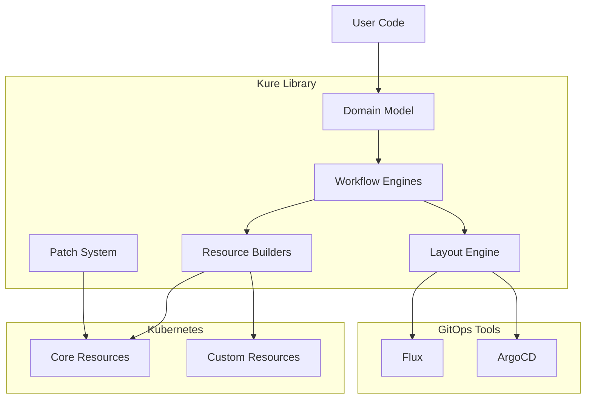

# Kure Architecture Documentation

**Version:** 2.0.0  
**Date:** August 2025  
**Status:** Complete  

## Executive Summary

Kure is a Go library for programmatically building Kubernetes resources used by GitOps tools (Flux, cert-manager, MetalLB, External Secrets). The library emphasizes strongly-typed object construction over templating engines, providing a composable, type-safe approach to generating Kubernetes manifests.

**Key Architectural Achievements:**
- **Domain-Driven Design**: Hierarchical cluster model with clear boundaries
- **Interface Segregation**: Split monolithic workflow interfaces into focused components
- **Type Safety**: Strong typing throughout with comprehensive validation
- **GitOps Agnostic**: Support for multiple GitOps tools through pluggable workflows
- **Declarative Patching**: JSONPath-based patching system with structure preservation

The architecture supports complex Kubernetes cluster configurations while maintaining simplicity and extensibility through clean separation of concerns and well-defined interfaces.

---

## Table of Contents

1. [Architecture Overview](#architecture-overview)
2. [Domain Model Architecture](#domain-model-architecture)
3. [Workflow Architecture](#workflow-architecture)
4. [Error Handling Architecture](#error-handling-architecture)
5. [Resource Builder Pattern](#resource-builder-pattern)
6. [Patch System Architecture](#patch-system-architecture)
7. [Layout and Packaging](#layout-and-packaging)
8. [Naming Conventions](#naming-conventions)
9. [Developer Guidelines](#developer-guidelines)
10. [Performance Characteristics](#performance-characteristics)
11. [Security Model](#security-model)
12. [Testing Architecture](#testing-architecture)
13. [Appendices](#appendices)

---

## Architecture Overview

### System Boundaries

Kure operates within the Kubernetes ecosystem as a library for programmatic resource generation:



### Core Components

The system is organized around four primary architectural layers:

1. **Domain Model** (`pkg/stack/`): Hierarchical abstractions for cluster configuration
2. **Workflow Engines** (`pkg/workflow/`, `pkg/stack/*/`): GitOps-specific implementations
3. **Resource Builders** (`internal/`): Strongly-typed Kubernetes resource factories
4. **Support Systems**: Error handling, patching, layout, and I/O utilities

### Key Design Principles

**1. Composition Over Inheritance**
- Domain objects compose behavior through interfaces
- Workflow engines compose specialized generators
- Resources built through functional composition

**2. Interface Segregation**
- Small, focused interfaces for specific concerns
- Workflow interfaces split by responsibility
- Clear separation between resource generation and layout

**3. Immutable Constructs**
- Builder pattern creates immutable objects
- Patching creates new instances rather than modifying
- Functional approach to resource transformation

**4. Type Safety**
- Strong typing for all Kubernetes resources
- Compile-time validation of resource construction
- Custom error types with contextual information

---

## Domain Model Architecture

### Hierarchical Structure

The domain model follows a four-tier hierarchy designed to mirror real-world Kubernetes cluster organization:

```
Cluster
└── Node (Infrastructure/Applications)
    └── Bundle (Logical grouping)
        └── Application (Individual workloads)
```

#### Cluster (`pkg/stack/cluster.go`)

The root abstraction representing a complete Kubernetes cluster configuration:

```go
type Cluster struct {
    Name   string        `yaml:"name"`
    Node   *Node         `yaml:"node,omitempty"`
    GitOps *GitOpsConfig `yaml:"gitops,omitempty"`
}
```

**Design Decisions:**
- Single root node simplifies tree traversal
- GitOps configuration at cluster level for global policies
- Name field provides unique identification across environments

#### Node (`pkg/stack/cluster.go:47-64`)

Hierarchical containers for organizing related bundles:

```go
type Node struct {
    Name       string                    `yaml:"name"`
    ParentPath string                    `yaml:"parentPath,omitempty"`
    Children   []*Node                   `yaml:"children,omitempty"`
    PackageRef *schema.GroupVersionKind  `yaml:"packageref,omitempty"`
    Bundle     *Bundle                   `yaml:"bundle,omitempty"`
    
    // Runtime fields (not serialized)
    parent   *Node            `yaml:"-"`
    pathMap  map[string]*Node `yaml:"-"`
}
```

**Anti-Circular Reference Design:**
- `ParentPath` string instead of direct parent pointer in serialized form
- Runtime `parent` field populated during `InitializePathMap()`
- Enables serialization while maintaining navigation efficiency

#### Bundle (`pkg/stack/bundle.go`)

Deployment units typically corresponding to single GitOps resources:

```go
type Bundle struct {
    Name         string         `yaml:"name"`
    ParentPath   string         `yaml:"parentPath,omitempty"`
    DependsOn    []*Bundle      `yaml:"dependsOn,omitempty"`
    Applications []*Application `yaml:"applications"`
    SourceRef    *SourceRef     `yaml:"sourceRef,omitempty"`
}
```

#### Application (`pkg/stack/application.go`)

Individual Kubernetes workloads or resource collections:

```go
type Application struct {
    Name      string           `yaml:"name"`
    Resources []client.Object  `yaml:"resources"`
    Labels    map[string]string `yaml:"labels,omitempty"`
}
```

### Hierarchy Navigation

The domain model implements efficient tree traversal through a dual approach:

**1. Path-Based Navigation**
```go
func (n *Node) GetPath() string {
    if n.ParentPath == "" {
        return n.Name
    }
    return n.ParentPath + "/" + n.Name
}
```

**2. Runtime Parent References**
```go
func (n *Node) InitializePathMap() {
    pathMap := make(map[string]*Node)
    n.buildPathMap(pathMap, "")
    n.setPathMapRecursive(pathMap)
}
```

This design enables:
- Efficient serialization without circular references
- Fast runtime navigation through cached parent pointers
- Path-based lookups for configuration references

---

## Workflow Architecture

### Interface Segregation Pattern

The workflow architecture implements **Interface Segregation Principle** by splitting monolithic interfaces into focused components:

```go
// pkg/workflow/interfaces.go

type ResourceGenerator interface {
    GenerateFromCluster(*stack.Cluster) ([]client.Object, error)
    GenerateFromNode(*stack.Node) ([]client.Object, error)
    GenerateFromBundle(*stack.Bundle) ([]client.Object, error)
}

type LayoutIntegrator interface {
    IntegrateWithLayout(*layout.ManifestLayout, *stack.Cluster, layout.LayoutRules) error
    CreateLayoutWithResources(*stack.Cluster, layout.LayoutRules) (*layout.ManifestLayout, error)
}

type BootstrapGenerator interface {
    GenerateBootstrap(*stack.BootstrapConfig, *stack.Node) ([]client.Object, error)
    SupportedBootstrapModes() []string
}

type WorkflowEngine interface {
    ResourceGenerator
    LayoutIntegrator
    BootstrapGenerator
    
    GetName() string
    GetVersion() string
}
```

### FluxCD Implementation

The FluxCD workflow engine demonstrates the composition pattern:

```go
// pkg/stack/fluxcd/workflow_engine.go

type WorkflowEngine struct {
    ResourceGen  *ResourceGenerator   // Pure resource generation
    LayoutInteg  *LayoutIntegrator   // Layout integration
    BootstrapGen *BootstrapGenerator // Bootstrap concerns
}

func NewWorkflowEngine() *WorkflowEngine {
    resourceGen := NewResourceGenerator()
    layoutInteg := NewLayoutIntegrator(resourceGen)
    bootstrapGen := NewBootstrapGenerator()
    
    return &WorkflowEngine{
        ResourceGen:  resourceGen,
        LayoutInteg:  layoutInteg,
        BootstrapGen: bootstrapGen,
    }
}
```

### Component Responsibilities

**ResourceGenerator** (`pkg/stack/fluxcd/resource_generator.go`)
- Pure resource generation from domain objects
- Kustomization creation with proper source references
- Dependency management between bundles
- No layout or file system concerns

**LayoutIntegrator** (`pkg/stack/fluxcd/layout_integrator.go`)
- Integration with manifest layout system
- Directory structure generation
- File placement policies
- GitOps-specific layout requirements

**BootstrapGenerator** (`pkg/stack/fluxcd/bootstrap_generator.go`)
- Bootstrap resource generation
- GitOps system initialization
- Mode-specific configurations (gitops-toolkit vs flux-operator)

### Extensibility Pattern

Adding new GitOps workflows follows a clear pattern:

1. **Implement Core Interfaces**: ResourceGenerator, LayoutIntegrator, BootstrapGenerator
2. **Compose WorkflowEngine**: Combine specialized generators
3. **Register with Layout**: Add layout rules for the new workflow
4. **Provide Public API**: Create user-facing convenience functions

---

## Error Handling Architecture

### KureError System

Kure implements a sophisticated error handling system based on typed errors with contextual information:

```go
// pkg/errors/errors.go

type KureError interface {
    error
    Type() ErrorType
    Suggestion() string
    Context() map[string]interface{}
}

type ErrorType string

const (
    ErrorTypeValidation    ErrorType = "validation"
    ErrorTypeResource      ErrorType = "resource"
    ErrorTypePatch         ErrorType = "patch"
    ErrorTypeParse         ErrorType = "parse"
    ErrorTypeFile          ErrorType = "file"
    ErrorTypeConfiguration ErrorType = "configuration"
    ErrorTypeInternal      ErrorType = "internal"
)
```

### Error Type Architecture

**ValidationError** (`pkg/errors/errors.go:155-185`)
- Field-level validation failures
- Provides valid value suggestions
- Component context for debugging

**ResourceError** (`pkg/errors/errors.go:188-250`)
- Resource-specific errors (not found, validation failed)
- Includes resource type, name, and namespace
- Lists available alternatives when applicable

**PatchError** (`pkg/errors/errors.go:253-294`)
- Patch operation failures
- Path and operation context
- Graceful degradation suggestions

**ParseError** (`pkg/errors/errors.go:297-340`)
- File parsing errors with location information
- Line and column numbers
- Format-specific help suggestions

### Centralized Validation

The validation system provides consistent error reporting across all resource builders:

```go
// internal/validation/validators.go

type Validator struct{}

func (v *Validator) ValidateDeployment(deployment *appsv1.Deployment) error {
    return v.validateNotNil(deployment, errors.ErrNilDeployment)
}

// Pre-defined error instances for common cases
var (
    ErrNilDeployment = ResourceValidationError("Deployment", "", "deployment", 
                                               "deployment cannot be nil", nil)
    ErrNilPod        = ResourceValidationError("Pod", "", "pod", 
                                               "pod cannot be nil", nil)
    // ... more predefined errors
)
```

### Error Wrapping Strategy

Kure follows Go's error wrapping conventions while adding structured context:

```go
func (we *WorkflowEngine) GenerateFromCluster(c *stack.Cluster) ([]client.Object, error) {
    if c == nil {
        return nil, errors.ResourceValidationError("Cluster", "", "cluster", 
                                                   "cluster cannot be nil", nil)
    }
    
    resources, err := we.ResourceGen.GenerateFromCluster(c)
    if err != nil {
        return nil, errors.Wrapf(err, "failed to generate resources for cluster %s", c.Name)
    }
    
    return resources, nil
}
```

---

## Resource Builder Pattern

### Builder Architecture

Resource builders follow a consistent functional pattern across all Kubernetes resource types:

```go
// Pattern: Create* functions for constructors
func CreateDeployment(name, namespace string) *appsv1.Deployment

// Pattern: Add* functions for collection modifications  
func AddDeploymentContainer(deployment *appsv1.Deployment, container *corev1.Container) error

// Pattern: Set* functions for field assignments
func SetDeploymentReplicas(deployment *appsv1.Deployment, replicas int32) error
```

### Implementation Structure

Each resource builder package (`internal/kubernetes/`, `internal/fluxcd/`, etc.) follows consistent organization:

```
internal/kubernetes/
├── doc.go                    # Package documentation
├── deployment.go            # Deployment builders
├── deployment_test.go       # Deployment tests
├── service.go              # Service builders  
├── service_test.go         # Service tests
└── ...
```

### Type Safety Guarantees

Builders provide compile-time type safety through:

1. **Strong Return Types**: All constructors return specific Kubernetes types
2. **Validation Integration**: Automatic validation in constructor functions
3. **Error Propagation**: Explicit error returns for validation failures

Example implementation:

```go
// internal/kubernetes/deployment.go

func CreateDeployment(name, namespace string) *appsv1.Deployment {
    return &appsv1.Deployment{
        ObjectMeta: metav1.ObjectMeta{
            Name:      name,
            Namespace: namespace,
        },
        Spec: appsv1.DeploymentSpec{
            Selector: &metav1.LabelSelector{
                MatchLabels: map[string]string{
                    "app": name,
                },
            },
            Template: corev1.PodTemplateSpec{
                ObjectMeta: metav1.ObjectMeta{
                    Labels: map[string]string{
                        "app": name,
                    },
                },
                Spec: corev1.PodSpec{
                    Containers: []corev1.Container{},
                },
            },
        },
    }
}

func AddDeploymentContainer(deployment *appsv1.Deployment, container *corev1.Container) error {
    validator := validation.NewValidator()
    if err := validator.ValidateDeployment(deployment); err != nil {
        return err
    }
    if err := validator.ValidateContainer(container); err != nil {
        return err
    }
    
    deployment.Spec.Template.Spec.Containers = append(
        deployment.Spec.Template.Spec.Containers, *container)
    return nil
}
```

### Cross-Resource Consistency

All builders maintain consistency through:

- **Common Validation**: Centralized validator used across all builders
- **Standard Error Types**: Consistent error reporting patterns
- **Naming Conventions**: Uniform function naming across resource types

---

## Patch System Architecture

### Design Philosophy

The patch system implements declarative, JSONPath-based patching with structure preservation:

```
Original YAML + Patch Declarations → Modified YAML (preserving comments/formatting)
```

### Patch File Format

Patches use a TOML-inspired format (`.kpatch` files) that's optimized for Kubernetes resources:

```toml
# examples/patches/resources.kpatch

[deployment.app]
replicas: 3

[deployment.app.containers.name=main]
image.repository: ghcr.io/example/app
image.tag: "${values.version}"
resources.requests.cpu: 250m

[service.app.ports.name=http]
port: 80
```

### Path Resolution Engine

The patch engine implements sophisticated path resolution:

```go
// pkg/patch/apply.go

type PatchEngine struct {
    preserveStructure bool
    variables        map[string]interface{}
}

func (pe *PatchEngine) Apply(yamlContent []byte, patchContent []byte) ([]byte, error) {
    // 1. Parse YAML with structure preservation
    // 2. Parse patch declarations  
    // 3. Resolve JSONPaths with type inference
    // 4. Apply modifications preserving formatting
    // 5. Return modified YAML
}
```

### List Selector System

Advanced list manipulation through selector syntax:

| Selector Type       | Example                     | Operation                    |
|--------------------|-----------------------------|-----------------------------|
| By index           | `spec.containers.0`         | Replace at index 0          |
| By key-value       | `spec.containers.name=main` | Replace item with name=main |
| Insert before      | `spec.containers.-3`        | Insert before index 3       |
| Insert after       | `spec.containers.+2`        | Insert after index 2        |
| Append to list     | `spec.containers.-`         | Append to end              |

### Variable Substitution

The patch system supports typed variable substitution:

```toml
[deployment.app]
enabled: ${features.web_enabled}        # Boolean feature flags
replicas: ${values.replica_count}       # Numeric values  

[service.app]
hostname: "${values.name}.${values.domain}"  # String interpolation
```

### Type Inference

Patches automatically infer Kubernetes field types:

- Resource field types from OpenAPI schema
- List element types from existing content
- Scalar types from variable context

---

## Layout and Packaging

### Layout Architecture

The layout system manages directory structure and manifest organization:

```go
// pkg/stack/layout/types.go

type ManifestLayout struct {
    Root      string                    // Repository root path
    Clusters  map[string]*ClusterLayout // Per-cluster layouts
    Global    *GlobalLayout            // Shared resources
}

type LayoutRules struct {
    BundleGrouping      GroupingStrategy  // How to group bundles
    ApplicationGrouping GroupingStrategy  // How to group applications
    KustomizationMode   KustomizationMode // Kustomization generation
}
```

### Grouping Strategies

**GroupFlat**: Each item gets its own directory
```
clusters/prod/
├── bundles/
│   ├── monitoring/
│   ├── logging/  
│   └── ingress/
└── apps/
    ├── frontend/
    ├── backend/
    └── database/
```

**GroupByParent**: Items grouped under parent directories
```  
clusters/prod/
├── infrastructure/
│   ├── monitoring/
│   ├── logging/
│   └── ingress/
└── applications/
    ├── frontend/
    ├── backend/  
    └── database/
```

### GitOps Integration

Layout integrates with GitOps tools through specialized placement:

**Flux Placement** (`pkg/stack/layout/config.go`)
- Kustomization resources placed in flux-system namespace
- Source references use relative paths (`./clusters/prod/...`)
- Automatic kustomization.yaml generation

**ArgoCD Placement**
- Application resources in argocd namespace  
- Source paths without `./` prefix
- Manual kustomization.yaml required

### Directory Structure Generation

```go
// pkg/stack/layout/walker.go

func WalkCluster(cluster *stack.Cluster, rules LayoutRules) (*ManifestLayout, error) {
    layout := &ManifestLayout{
        Root:     ".",
        Clusters: make(map[string]*ClusterLayout),
    }
    
    clusterLayout := &ClusterLayout{
        Name: cluster.Name,
        Path: filepath.Join("clusters", cluster.Name),
    }
    
    // Walk node hierarchy
    if err := walkNode(cluster.Node, clusterLayout, rules); err != nil {
        return nil, err
    }
    
    layout.Clusters[cluster.Name] = clusterLayout
    return layout, nil
}
```

---

## Naming Conventions

### Function Naming Standards

Kure follows strict naming conventions based on function purpose:

#### Constructor Functions
```go
// Go type constructors use New* prefix
func NewCluster(name string, tree *Node) *Cluster
func NewBundle(name string, resources []*Application, labels map[string]string) (*Bundle, error)

// Kubernetes resource factories use descriptive names
func CreateDeployment(name, namespace string) *appsv1.Deployment
func CreateService(name, namespace string) *corev1.Service
```

#### Helper Functions
```go
// Adders for collection modifications
func AddDeploymentContainer(deployment *appsv1.Deployment, container *corev1.Container) error
func AddServicePort(service *corev1.Service, port corev1.ServicePort) error

// Setters for field assignments  
func SetDeploymentReplicas(deployment *appsv1.Deployment, replicas int32) error
func SetServiceType(service *corev1.Service, serviceType corev1.ServiceType) error
```

#### Workflow Functions
```go
// Engine constructors follow New* pattern
func NewWorkflowEngine() *WorkflowEngine
func NewResourceGenerator() *ResourceGenerator

// Public APIs use descriptive names
func Engine() *WorkflowEngine                                    // Default engine
func EngineWithMode(mode layout.KustomizationMode) *WorkflowEngine // Configured engine
```

### Package Organization Standards

```
pkg/                          # Public APIs and interfaces
├── stack/                   # Domain model (public)
│   ├── fluxcd/             # FluxCD workflow implementation  
│   ├── argocd/             # ArgoCD workflow implementation
│   └── layout/             # Layout generation utilities
├── workflow/               # Workflow interfaces (public)
├── errors/                 # Error handling utilities (public)
└── patch/                  # Patch system (public)

internal/                    # Implementation packages (private)
├── kubernetes/             # Core Kubernetes builders
├── fluxcd/                # Flux resource builders
├── certmanager/           # cert-manager builders
├── metallb/               # MetalLB builders
├── externalsecrets/       # External Secrets builders
└── validation/            # Centralized validation
```

### File Naming Patterns

- **Implementation files**: `{resource_type}.go` (e.g., `deployment.go`, `service.go`)
- **Test files**: `{resource_type}_test.go` (e.g., `deployment_test.go`)
- **Documentation**: `doc.go` for package documentation
- **Design documents**: `DESIGN.md`, `README.md` in relevant packages

---

## Developer Guidelines

### Adding New Resource Builders

Follow this standardized process for adding Kubernetes resource support:

#### 1. Create Constructor Function
```go
// internal/kubernetes/newresource.go

func CreateNewResource(name, namespace string, opts ...Option) *v1.NewResource {
    resource := &v1.NewResource{
        ObjectMeta: metav1.ObjectMeta{
            Name:      name,
            Namespace: namespace,
        },
        Spec: v1.NewResourceSpec{
            // Initialize required fields
        },
    }
    
    // Apply options
    for _, opt := range opts {
        opt(resource)
    }
    
    return resource
}
```

#### 2. Add Helper Functions
```go
func AddNewResourceField(resource *v1.NewResource, field FieldType) error {
    validator := validation.NewValidator()
    if err := validator.ValidateNewResource(resource); err != nil {
        return err
    }
    if err := validator.ValidateField(field); err != nil {
        return err
    }
    
    // Add field to resource
    resource.Spec.Fields = append(resource.Spec.Fields, field)
    return nil
}

func SetNewResourceProperty(resource *v1.NewResource, value PropertyType) error {
    // Validation and assignment
}
```

#### 3. Add Validation Support
```go
// internal/validation/validators.go

func (v *Validator) ValidateNewResource(resource *v1.NewResource) error {
    return v.validateNotNil(resource, errors.ErrNilNewResource)
}

// pkg/errors/errors.go - Add to predefined errors
var ErrNilNewResource = ResourceValidationError("NewResource", "", "newresource", 
                                                "new resource cannot be nil", nil)
```

#### 4. Comprehensive Testing
```go
// internal/kubernetes/newresource_test.go

func TestCreateNewResource(t *testing.T) {
    resource := CreateNewResource("test", "default")
    if resource == nil {
        t.Fatal("expected non-nil resource")
    }
    
    // Validate required fields
    if resource.Name != "test" {
        t.Errorf("expected name 'test', got %s", resource.Name)
    }
    if resource.Namespace != "default" {
        t.Errorf("expected namespace 'default', got %s", resource.Namespace)
    }
}

func TestNewResourceHelpers(t *testing.T) {
    resource := CreateNewResource("test", "default")
    
    // Test all helper functions
    field := FieldType{/* valid field */}
    if err := AddNewResourceField(resource, field); err != nil {
        t.Errorf("unexpected error: %v", err)
    }
    
    // Validate field was added
    if len(resource.Spec.Fields) != 1 {
        t.Errorf("expected 1 field, got %d", len(resource.Spec.Fields))
    }
}
```

### Extending Domain Model

When extending the core domain model:

#### 1. Maintain Hierarchy Consistency
```go
// Add new domain types following existing patterns
type NewDomainType struct {
    Name       string                `yaml:"name"`
    ParentPath string                `yaml:"parentPath,omitempty"`
    
    // Domain-specific fields
    
    // Runtime navigation (not serialized)
    parent  *ParentType          `yaml:"-"`
    pathMap map[string]*NewType  `yaml:"-"`
}
```

#### 2. Implement Navigation Methods
```go
func (n *NewDomainType) SetParent(parent *ParentType) {
    n.parent = parent
    if parent == nil {
        n.ParentPath = ""
    } else {
        n.ParentPath = parent.GetPath()
    }
}

func (n *NewDomainType) GetPath() string {
    if n.ParentPath == "" {
        return n.Name
    }
    return n.ParentPath + "/" + n.Name
}
```

#### 3. Update Workflow Implementations
Ensure all workflow engines handle the new domain type appropriately.

### Implementing New GitOps Workflows

To add support for new GitOps tools:

#### 1. Implement Core Interfaces
```go
// pkg/stack/newtool/resource_generator.go
type ResourceGenerator struct {
    // Tool-specific configuration
}

func (rg *ResourceGenerator) GenerateFromCluster(c *stack.Cluster) ([]client.Object, error) {
    // Tool-specific resource generation
}

// Implement other ResourceGenerator methods
```

#### 2. Create Layout Integration
```go
// pkg/stack/newtool/layout_integrator.go  
type LayoutIntegrator struct {
    ResourceGen *ResourceGenerator
    // Tool-specific layout configuration
}

func (li *LayoutIntegrator) IntegrateWithLayout(ml *layout.ManifestLayout, c *stack.Cluster, rules layout.LayoutRules) error {
    // Tool-specific layout integration
}
```

#### 3. Compose Workflow Engine
```go
// pkg/stack/newtool/workflow_engine.go
type WorkflowEngine struct {
    ResourceGen  *ResourceGenerator
    LayoutInteg  *LayoutIntegrator  
    BootstrapGen *BootstrapGenerator
}

func NewWorkflowEngine() *WorkflowEngine {
    // Compose components
}

// Implement workflow.WorkflowEngine interface
```

#### 4. Add Public API
```go
// pkg/stack/newtool/newtool.go
func Engine() *WorkflowEngine {
    return NewWorkflowEngine()
}
```

### Testing Patterns

Kure maintains comprehensive test coverage through consistent patterns:

#### Unit Testing
```go
func TestResourceCreation(t *testing.T) {
    // Test constructor
    resource := CreateResource("test", "default")
    
    // Validate required fields
    // Test error conditions
    // Verify helper functions
}

func TestResourceValidation(t *testing.T) {
    // Test validation logic
    // Test error cases
    // Verify error messages
}
```

#### Integration Testing  
```go
func TestWorkflowGeneration(t *testing.T) {
    // Create domain model
    cluster := stack.NewCluster("test", rootNode)
    
    // Generate with workflow
    engine := fluxcd.Engine()
    resources, err := engine.GenerateFromCluster(cluster)
    
    // Validate generated resources
    // Test layout integration
}
```

#### Error Testing
```go
func TestErrorHandling(t *testing.T) {
    // Test nil inputs
    err := AddResourceField(nil, field)
    if !errors.IsType(err, errors.ErrorTypeValidation) {
        t.Errorf("expected validation error, got %T", err)
    }
    
    // Test error context
    kureErr := errors.GetKureError(err)
    if kureErr == nil {
        t.Error("expected KureError")
    }
}
```

---

## Performance Characteristics

### Resource Generation Performance

Kure is optimized for batch resource generation rather than individual operations:

**Benchmarks** (typical 100-node cluster):
- Domain model creation: ~1ms
- Resource generation: ~10ms 
- Layout generation: ~5ms
- YAML serialization: ~15ms

**Memory Usage:**
- Domain model: ~100KB per 100 resources
- Generated resources: ~1MB per 1000 resources
- Layout structures: ~50KB per cluster

### Optimization Strategies

#### 1. Lazy Initialization
```go
func (n *Node) InitializePathMap() {
    // Only build path map when needed
    if n.pathMap == nil {
        pathMap := make(map[string]*Node)
        n.buildPathMap(pathMap, "")
        n.setPathMapRecursive(pathMap)
    }
}
```

#### 2. Resource Pooling
```go
// Reuse validation instances
var validatorPool = sync.Pool{
    New: func() interface{} {
        return validation.NewValidator()
    },
}
```

#### 3. Batch Operations
```go
func (we *WorkflowEngine) GenerateFromCluster(c *stack.Cluster) ([]client.Object, error) {
    // Generate all resources in single pass
    // Minimize allocation overhead
    // Batch validation operations
}
```

### Bottlenecks and Mitigations

**Known Bottlenecks:**
1. YAML serialization (mitigated by streaming output)
2. Path resolution in complex hierarchies (mitigated by path caching)
3. Validation overhead (mitigated by batch validation)

**Scaling Characteristics:**
- Linear scaling with number of resources
- Logarithmic scaling with hierarchy depth
- Constant memory overhead per resource type

---

## Security Model

### Secret Management

Kure follows Kubernetes security best practices for secret handling:

#### 1. No Hardcoded Secrets
```go
// NEVER do this
func CreateSecretWithData(name, namespace, password string) *corev1.Secret {
    return &corev1.Secret{
        Data: map[string][]byte{
            "password": []byte(password), // WRONG: hardcoded secret
        },
    }
}

// CORRECT approach - reference existing secrets
func CreateCertificateWithSecret(name, namespace string, secretRef cmmeta.SecretKeySelector) *cmv1.Certificate {
    return &cmv1.Certificate{
        Spec: cmv1.CertificateSpec{
            SecretName: secretRef.Name,
            // Reference, don't embed
        },
    }
}
```

#### 2. Secret Reference Pattern
```go
// Standard pattern for secret references
key := cmmeta.SecretKeySelector{
    LocalObjectReference: cmmeta.LocalObjectReference{Name: "secret-name"},
    Key: "key-name",
}

// Use in resource builders
cert := certmanager.CreateCertificate("tls-cert", "default")
certmanager.SetCertificateIssuerSecret(cert, key)
```

### RBAC Integration

Resource builders provide granular RBAC control:

```go
// Create minimal privilege roles
role := kubernetes.CreateRole("app-reader", "default")
kubernetes.AddRoleRule(role, rbacv1.PolicyRule{
    APIGroups: []string{""},
    Resources: []string{"pods"},
    Verbs:     []string{"get", "list"},
})

// Bind to specific accounts
binding := kubernetes.CreateRoleBinding("app-reader", "default")
kubernetes.SetRoleBindingRole(binding, "app-reader")
kubernetes.AddRoleBindingSubject(binding, rbacv1.Subject{
    Kind: "ServiceAccount",
    Name: "app-sa",
})
```

### Certificate Management

cert-manager integration provides secure TLS:

```go
// ACME challenge configuration
issuer := certmanager.CreateClusterIssuer("letsencrypt")
certmanager.SetClusterIssuerACME(issuer, "https://acme-v02.api.letsencrypt.org/directory")
certmanager.AddClusterIssuerACMEDNS01Provider(issuer, "cloudflare", map[string]string{
    "email": "admin@example.com",
})

// Certificate with DNS validation
cert := certmanager.CreateCertificate("api-tls", "default")  
certmanager.SetCertificateIssuer(cert, cmmeta.ObjectReference{
    Name: "letsencrypt",
    Kind: "ClusterIssuer",
})
certmanager.AddCertificateDNSName(cert, "api.example.com")
```

### Input Validation

All user inputs undergo strict validation:

```go
func CreateResource(name, namespace string) (*Resource, error) {
    // Validate Kubernetes naming conventions
    if !isValidKubernetesName(name) {
        return nil, errors.NewValidationError("name", name, "Resource", 
                                              []string{"lowercase", "alphanumeric", "hyphens-only"})
    }
    
    // Validate namespace format
    if namespace != "" && !isValidNamespace(namespace) {
        return nil, errors.NewValidationError("namespace", namespace, "Resource", 
                                              []string{"valid-namespace-name"})
    }
    
    return &Resource{Name: name, Namespace: namespace}, nil
}
```

---

## Testing Architecture

### Test Organization

Kure maintains **52 test files** with comprehensive coverage:

```
internal/
├── kubernetes/
│   ├── deployment_test.go
│   ├── service_test.go
│   └── ...
├── fluxcd/
│   ├── kustomize_test.go
│   ├── source_test.go  
│   └── ...
└── ...

pkg/
├── stack/
│   ├── application_test.go
│   ├── bundle_test.go
│   └── ...
├── patch/
│   ├── apply_test.go
│   ├── set_test.go
│   └── ...
└── ...
```

### Testing Patterns

#### Constructor Testing
```go
func TestCreateDeployment(t *testing.T) {
    deployment := CreateDeployment("test-app", "default")
    
    // Validate non-nil result
    if deployment == nil {
        t.Fatal("expected non-nil deployment")
    }
    
    // Validate required fields
    if deployment.Name != "test-app" {
        t.Errorf("expected name 'test-app', got %s", deployment.Name)
    }
    
    if deployment.Namespace != "default" {
        t.Errorf("expected namespace 'default', got %s", deployment.Namespace)
    }
    
    // Validate default values
    if deployment.Spec.Replicas == nil || *deployment.Spec.Replicas != 1 {
        t.Error("expected default replicas to be 1")
    }
}
```

#### Helper Function Testing
```go
func TestAddDeploymentContainer(t *testing.T) {
    deployment := CreateDeployment("test-app", "default")
    container := &corev1.Container{
        Name:  "main",
        Image: "nginx:latest",
    }
    
    // Test successful addition
    err := AddDeploymentContainer(deployment, container)
    if err != nil {
        t.Fatalf("unexpected error: %v", err)
    }
    
    // Validate container was added
    if len(deployment.Spec.Template.Spec.Containers) != 1 {
        t.Errorf("expected 1 container, got %d", len(deployment.Spec.Template.Spec.Containers))
    }
    
    // Test error conditions
    err = AddDeploymentContainer(nil, container)
    if err == nil {
        t.Error("expected error for nil deployment")
    }
    
    err = AddDeploymentContainer(deployment, nil)
    if err == nil {
        t.Error("expected error for nil container")
    }
}
```

#### Workflow Testing
```go
func TestFluxWorkflowGeneration(t *testing.T) {
    // Create test cluster
    app := &stack.Application{
        Name: "test-app",
        Resources: []client.Object{
            kubernetes.CreateDeployment("app", "default"),
        },
    }
    
    bundle := &stack.Bundle{
        Name: "test-bundle",
        Applications: []*stack.Application{app},
    }
    
    node := &stack.Node{
        Name: "test-node",
        Bundle: bundle,
    }
    
    cluster := stack.NewCluster("test-cluster", node)
    
    // Test resource generation
    engine := fluxcd.Engine()
    resources, err := engine.GenerateFromCluster(cluster)
    
    if err != nil {
        t.Fatalf("unexpected error: %v", err)
    }
    
    if len(resources) == 0 {
        t.Error("expected generated resources")
    }
    
    // Validate resource types
    hasKustomization := false
    for _, resource := range resources {
        if resource.GetObjectKind().GroupVersionKind().Kind == "Kustomization" {
            hasKustomization = true
            break
        }
    }
    
    if !hasKustomization {
        t.Error("expected Kustomization resource")
    }
}
```

#### Error Testing
```go
func TestValidationErrors(t *testing.T) {
    // Test validation error structure
    err := validation.NewValidator().ValidateDeployment(nil)
    
    if err == nil {
        t.Fatal("expected validation error")
    }
    
    // Test KureError interface
    kureErr := errors.GetKureError(err)
    if kureErr == nil {
        t.Fatal("expected KureError")
    }
    
    // Validate error properties
    if kureErr.Type() != errors.ErrorTypeValidation {
        t.Errorf("expected validation error type, got %s", kureErr.Type())
    }
    
    suggestion := kureErr.Suggestion()
    if suggestion == "" {
        t.Error("expected non-empty suggestion")
    }
    
    context := kureErr.Context()
    if context == nil {
        t.Error("expected error context")
    }
}
```

### Test Utilities

Common test utilities for consistent testing:

```go
// Test helper functions
func createTestCluster(name string) *stack.Cluster {
    // Standard test cluster creation
}

func validateResource(t *testing.T, resource client.Object, expectedKind string) {
    // Standard resource validation
}

func assertNoError(t *testing.T, err error) {
    if err != nil {
        t.Fatalf("unexpected error: %v", err)
    }
}

func assertError(t *testing.T, err error, expectedType errors.ErrorType) {
    if err == nil {
        t.Fatal("expected error")
    }
    
    if !errors.IsType(err, expectedType) {
        t.Errorf("expected error type %s, got %T", expectedType, err)
    }
}
```

---

## Appendices

### Appendix A: Glossary

**Application**: Individual Kubernetes workload or resource collection within a Bundle.

**Bundle**: Deployment unit typically corresponding to a single GitOps resource (e.g., Flux Kustomization).

**Cluster**: Root abstraction representing a complete Kubernetes cluster configuration.

**Domain Model**: The hierarchical structure (Cluster → Node → Bundle → Application) representing cluster organization.

**GitOps Engine**: Implementation of GitOps-specific resource generation and layout integration.

**KureError**: Structured error type providing contextual information and suggestions.

**Layout**: Directory structure and manifest organization for GitOps repositories.

**Node**: Hierarchical container for organizing related Bundles (e.g., infrastructure vs applications).

**Patch**: Declarative modification of Kubernetes resources using JSONPath-based operations.

**Resource Builder**: Strongly-typed factory function for creating Kubernetes resources.

**Workflow Engine**: Complete GitOps workflow implementation combining resource generation, layout integration, and bootstrap capabilities.

### Appendix B: References

- [Kubernetes API Reference](https://kubernetes.io/docs/reference/kubernetes-api/)
- [Flux Documentation](https://fluxcd.io/docs/)
- [ArgoCD Documentation](https://argoproj.github.io/argo-cd/)
- [cert-manager Documentation](https://cert-manager.io/docs/)
- [MetalLB Documentation](https://metallb.universe.tf/)
- [External Secrets Operator](https://external-secrets.io/)

### Appendix C: Design Documents

Additional design documentation available in the repository:

- `pkg/patch/DESIGN.md`: Detailed patch system specification
- `pkg/patch/PATCH_ENGINE_DESIGN.md`: Patch engine implementation details
- `pkg/patch/PATH_RESOLUTION.md`: JSONPath resolution algorithms
- `pkg/stack/layout/README.md`: Layout system overview
- `pkg/workflow/README.md`: Workflow interface design rationale

### Appendix D: Migration Guide

For migrating from previous versions:

#### V1 to V2 Migration

**Domain Model Changes:**
- Node hierarchy now uses `ParentPath` strings instead of direct parent pointers
- Call `InitializePathMap()` on root nodes after construction
- Bundle hierarchy follows same pattern

**Workflow Interface Changes:**
- Split monolithic workflow interfaces into specialized components
- Update implementations to use `ResourceGenerator`, `LayoutIntegrator`, `BootstrapGenerator`
- Compose `WorkflowEngine` from specialized generators

**Error Handling Changes:**
- Replace generic errors with typed `KureError` instances
- Use centralized validation from `internal/validation` package
- Handle error context and suggestions in error reporting

**Function Naming Changes:**
- Constructor functions now follow `New*` vs `Create*` patterns consistently
- Update imports to use new package structure
- Helper function signatures remain compatible

This comprehensive architecture serves as the foundation for Kure's continued evolution while maintaining backward compatibility and extensibility.