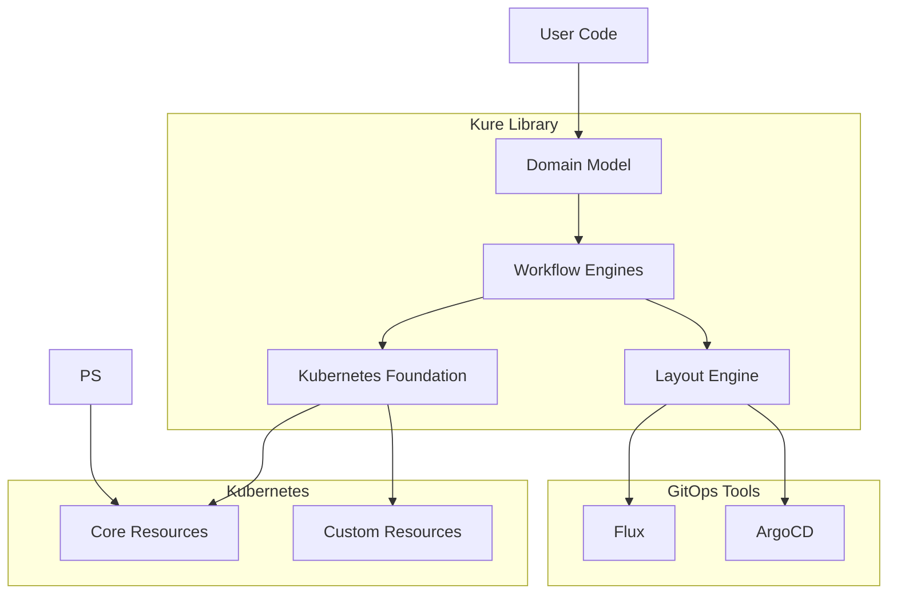

# Kure Architecture Documentation

## Executive Summary

Kure is a GitOps domain model and layout engine on a thin Kubernetes foundation. The domain model
(`pkg/stack`) says what a cluster contains; the layout engine (`pkg/stack/layout`,
`pkg/stack/fluxcd`) writes that out as a reconcilable directory tree of plain YAML; the Kubernetes
foundation (`pkg/kubernetes`) supplies the scheme, one generic constructor, the generated per-kind
wrappers over it, and a small admissible set of sugar helpers.

The foundation is thin on purpose. The upstream Go struct is the construction API — kure sets
identity and stops — so the library's surface stays small enough to keep stable while the domain
model above it carries the opinions.

**Key Architectural Achievements:**
- **Domain-Driven Design**: Hierarchical cluster model with clear boundaries
- **Interface Segregation**: Split monolithic workflow interfaces into focused components
- **Thin Kubernetes foundation**: Identity-only constructors, generated from the registered scheme,
  under a contract that is asserted by tests rather than described by convention
  ([Kubernetes Builders](/api-reference/kubernetes-builders/) is normative)
- **Derived, not hand-kept**: Which kinds exist, their scope, and which of their fields are
  feature-gated or deprecated are all read out of the pinned upstream modules
- **GitOps Agnostic**: Support for multiple GitOps tools through pluggable workflows
- **Declarative Patching**: JSONPath-based patching system with structure preservation *(moved to go-kure/launcher)*

The architecture supports complex Kubernetes cluster configurations while maintaining simplicity and extensibility through clean separation of concerns and well-defined interfaces.

---

## Table of Contents

1. [Architecture Overview](#architecture-overview)
2. [Domain Model Architecture](#domain-model-architecture)
3. [Workflow Architecture](#workflow-architecture)
4. [Error Handling Architecture](#error-handling-architecture)
5. [Kubernetes Foundation](#kubernetes-foundation)
6. [Patch System Architecture](#patch-system-architecture)
7. [Layout and Packaging](#layout-and-packaging)
8. [Naming Conventions](#naming-conventions)
9. [Developer Guidelines](#developer-guidelines)
10. [Performance Characteristics](#performance-characteristics)
11. [Security Model](#security-model)
12. [Testing Architecture](#testing-architecture)
13. [Appendices](#appendices)

---

## Architecture Overview

### System Boundaries

Kure operates within the Kubernetes ecosystem as a library for programmatic resource generation:


```mermaid
graph TB
    subgraph "Kure Library"
        DM[Domain Model]
        WF[Workflow Engines]
        RB[Kubernetes Foundation]
        LO[Layout Engine]
    end
    
    subgraph "GitOps Tools"
        FLUX[Flux]
        ARGO[ArgoCD]
    end
    
    subgraph "Kubernetes"
        K8S[Core Resources]
        CRD[Custom Resources]
    end
    
    USER[User Code] --> DM
    DM --> WF
    WF --> RB
    RB --> K8S
    RB --> CRD
    WF --> LO
    LO --> FLUX
    LO --> ARGO
    PS --> K8S
```

### Core Components

The system is organized around four primary architectural layers:

1. **Domain Model** (`pkg/stack/`): Hierarchical abstractions for cluster configuration
2. **Workflow Engines** (`pkg/stack/workflow.go`, `pkg/stack/fluxcd/`, `pkg/stack/argocd/`): GitOps-specific implementations
3. **Kubernetes Foundation** (`pkg/kubernetes/` and its per-CRD subpackages): the registered
   scheme, the generic `Create[T]` constructor and its generated per-kind wrappers, the admissible
   sugar helpers, and the generated kinds/scope/maturity tables
4. **Support Systems**: Error handling, layout, and I/O utilities

### What kure does NOT provide

kure is an unopinionated foundation. It provides building blocks — it does not compose them into
named application patterns or OAM abstractions.

| Not in kure | Reason |
|-------------|--------|
| Application-level components (webservice, worker, helmrelease) | Downstream consumers have different opinions on what each means |
| Trait logic (ingress, certificate, external-secret) | Trait implementation depends on platform capabilities |
| OAM model (Application, Component, Trait, Policy) | This belongs in the OAM runtime layer (launcher) |
| Policy enforcement | Enforcement rules are organizational — not a library concern |
| GitOps delivery layout decisions | Each consumer defines its own OCI artifact hierarchy |

**Why this matters for library design.** If kure defined a `WebserviceConfig`, it would need to
decide: does it include a `ServiceAccount`? Topology spread constraints? Sidecars? Each downstream
consumer has different answers. Putting the composed abstraction in the library couples all
consumers to kure's version of that answer. kure avoids this by providing composable primitives and
leaving composition to consumers.

### Key Design Principles

**1. Composition Over Inheritance**
- Domain objects compose behavior through interfaces
- Workflow engines compose specialized generators
- Resources built through functional composition

**2. Interface Segregation**
- Small, focused interfaces for specific concerns
- Workflow interfaces split by responsibility
- Clear separation between resource generation and layout

**3. Immutable Constructs**
- Builder pattern creates immutable objects
- Patching creates new instances rather than modifying
- Functional approach to resource transformation

**4. Type Safety**
- Strong typing for all Kubernetes resources
- Compile-time validation of resource construction
- Custom error types with contextual information

### Relationship to Launcher

[launcher](https://github.com/go-kure/launcher) is an OAM-native package manager built on kure.
The dependency is strictly one-directional: launcher imports kure; kure has no dependency on
launcher.

```
downstream consumers
        │
        ▼
   launcher (OAM runtime)
        │
        ▼
    kure (library)
```

kure provides the building blocks — `ApplicationConfig` interface, K8s resource builders, FluxCD
workflow primitives. Launcher uses these to implement an OAM-to-manifest pipeline with component
handlers, trait handlers, and a Policy extension point for downstream enforcement.

Downstream consumers that need capabilities beyond launcher's built-in handlers can register
additional handlers and implement the `launcher.Policy` interface, while still using kure's
resource builders directly.

For the full layering model see
[kure-launcher-architecture](https://github.com/go-kure/.github/blob/main/docs/design/kure-launcher-architecture.md).

---

## Domain Model Architecture

### Hierarchical Structure

The domain model follows a four-tier hierarchy designed to mirror real-world Kubernetes cluster organization:

```
Cluster
└── Node (Infrastructure/Applications)
    └── Bundle (Logical grouping)
        └── Application (Individual workloads)
```

#### Cluster (`pkg/stack/cluster.go`)

The root abstraction representing a complete Kubernetes cluster configuration:

```go
type Cluster struct {
    Name   string        `yaml:"name"`
    Node   *Node         `yaml:"node,omitempty"`
    GitOps *GitOpsConfig `yaml:"gitops,omitempty"`
}
```

**Design Decisions:**
- Single root node simplifies tree traversal
- GitOps configuration at cluster level for global policies
- Name field provides unique identification across environments

#### Node (`pkg/stack/cluster.go:47-64`)

Hierarchical containers for organizing related bundles:

```go
type Node struct {
    Name       string                    `yaml:"name"`
    ParentPath string                    `yaml:"parentPath,omitempty"`
    Children   []*Node                   `yaml:"children,omitempty"`
    PackageRef *schema.GroupVersionKind  `yaml:"packageref,omitempty"`
    Bundle     *Bundle                   `yaml:"bundle,omitempty"`
    
    // Runtime fields (not serialized)
    parent   *Node            `yaml:"-"`
    pathMap  map[string]*Node `yaml:"-"`
}
```

**Anti-Circular Reference Design:**
- `ParentPath` string instead of direct parent pointer in serialized form
- Runtime `parent` field populated during `InitializePathMap()`
- Enables serialization while maintaining navigation efficiency

#### Bundle (`pkg/stack/bundle.go`)

Deployment units typically corresponding to single GitOps resources:

```go
type Bundle struct {
    Name         string         `yaml:"name"`
    ParentPath   string         `yaml:"parentPath,omitempty"`
    DependsOn    []*Bundle      `yaml:"dependsOn,omitempty"`
    Applications []*Application `yaml:"applications"`
    SourceRef    *SourceRef     `yaml:"sourceRef,omitempty"`
}
```

#### Application (`pkg/stack/application.go`)

Individual Kubernetes workloads or resource collections:

```go
type Application struct {
    Name      string           `yaml:"name"`
    Resources []client.Object  `yaml:"resources"`
    Labels    map[string]string `yaml:"labels,omitempty"`
}
```

### Hierarchy Navigation

The domain model implements efficient tree traversal through a dual approach:

**1. Path-Based Navigation**
```go
func (n *Node) GetPath() string {
    if n.ParentPath == "" {
        return n.Name
    }
    return n.ParentPath + "/" + n.Name
}
```

**2. Runtime Parent References**
```go
func (n *Node) InitializePathMap() {
    pathMap := make(map[string]*Node)
    n.buildPathMap(pathMap, "")
    n.setPathMapRecursive(pathMap)
}
```

This design enables:
- Efficient serialization without circular references
- Fast runtime navigation through cached parent pointers
- Path-based lookups for configuration references

---

## Workflow Architecture

### Interface Segregation Pattern

The workflow architecture implements **Interface Segregation Principle** by splitting monolithic interfaces into focused components:

```go
// pkg/stack/workflow.go

type ResourceGenerator interface {
    GenerateFromCluster(*stack.Cluster) ([]client.Object, error)
    GenerateFromNode(*stack.Node) ([]client.Object, error)
    GenerateFromBundle(*stack.Bundle) ([]client.Object, error)
}

type LayoutIntegrator interface {
    IntegrateWithLayout(*layout.ManifestLayout, *stack.Cluster, layout.LayoutRules) error
    CreateLayoutWithResources(*stack.Cluster, layout.LayoutRules) (*layout.ManifestLayout, error)
}

type BootstrapGenerator interface {
    GenerateBootstrap(*stack.BootstrapConfig, *stack.Node) ([]client.Object, error)
    SupportedBootstrapModes() []string
}

type WorkflowEngine interface {
    ResourceGenerator
    LayoutIntegrator
    BootstrapGenerator
    
    GetName() string
    GetVersion() string
}
```

### FluxCD Implementation

The FluxCD workflow engine demonstrates the composition pattern:

```go
// pkg/stack/fluxcd/workflow_engine.go

type WorkflowEngine struct {
    ResourceGen  *ResourceGenerator   // Pure resource generation
    LayoutInteg  *LayoutIntegrator   // Layout integration
    BootstrapGen *BootstrapGenerator // Bootstrap concerns
}

func NewWorkflowEngine() *WorkflowEngine {
    resourceGen := NewResourceGenerator()
    layoutInteg := NewLayoutIntegrator(resourceGen)
    bootstrapGen := NewBootstrapGenerator()
    
    return &WorkflowEngine{
        ResourceGen:  resourceGen,
        LayoutInteg:  layoutInteg,
        BootstrapGen: bootstrapGen,
    }
}
```

### Component Responsibilities

**ResourceGenerator** (`pkg/stack/fluxcd/resource_generator.go`)
- Pure resource generation from domain objects
- Kustomization creation with proper source references
- Dependency management between bundles
- No layout or file system concerns

**LayoutIntegrator** (`pkg/stack/fluxcd/layout_integrator.go`)
- Integration with manifest layout system
- Directory structure generation
- File placement policies
- GitOps-specific layout requirements

**BootstrapGenerator** (`pkg/stack/fluxcd/bootstrap_generator.go`)
- Bootstrap resource generation
- GitOps system initialization
- Mode-specific configurations (gitops-toolkit vs flux-operator)

### Extensibility Pattern

Adding new GitOps workflows follows a clear pattern:

1. **Implement Core Interfaces**: ResourceGenerator, LayoutIntegrator, BootstrapGenerator
2. **Compose WorkflowEngine**: Combine specialized generators
3. **Register with Layout**: Add layout rules for the new workflow
4. **Provide Public API**: Create user-facing convenience functions

---

## Error Handling Architecture

### KureError System

Kure implements a sophisticated error handling system based on typed errors with contextual information:

```go
// pkg/errors/errors.go

type KureError interface {
    error
    Type() ErrorType
    Suggestion() string
    Context() map[string]interface{}
}

type ErrorType string

const (
    ErrorTypeValidation    ErrorType = "validation"
    ErrorTypeResource      ErrorType = "resource"
    ErrorTypePatch         ErrorType = "patch"
    ErrorTypeParse         ErrorType = "parse"
    ErrorTypeFile          ErrorType = "file"
    ErrorTypeConfiguration ErrorType = "configuration"
    ErrorTypeInternal      ErrorType = "internal"
)
```

### Error Type Architecture

**ValidationError** (`pkg/errors/errors.go:155-185`)
- Field-level validation failures
- Provides valid value suggestions
- Component context for debugging

**ResourceError** (`pkg/errors/errors.go:188-250`)
- Resource-specific errors (not found, validation failed)
- Includes resource type, name, and namespace
- Lists available alternatives when applicable

**PatchError** (`pkg/errors/errors.go:253-294`)
- Patch operation failures
- Path and operation context
- Graceful degradation suggestions

**ParseError** (`pkg/errors/errors.go:297-340`)
- File parsing errors with location information
- Line and column numbers
- Format-specific help suggestions

### Error Wrapping Strategy

Kure follows Go's error wrapping conventions while adding structured context:

```go
func (we *WorkflowEngine) GenerateFromCluster(c *stack.Cluster) ([]client.Object, error) {
    if c == nil {
        return nil, errors.ResourceValidationError("Cluster", "", "cluster", 
                                                   "cluster cannot be nil", nil)
    }
    
    resources, err := we.ResourceGen.GenerateFromCluster(c)
    if err != nil {
        return nil, errors.Wrapf(err, "failed to generate resources for cluster %s", c.Name)
    }
    
    return resources, nil
}
```

---

## Kubernetes Foundation

The [Kubernetes Builders](/api-reference/kubernetes-builders/) page is the normative text of the
builder contract (ADR-038, "thin core + admissible sugar"). This section describes how that
contract sits in the architecture; where the two differ, that page wins.

### The canonical path

For every registered kind the upstream Go struct is the construction API. kure allocates the
object, stamps `TypeMeta` from the registered scheme and writes `metadata.name` (and
`metadata.namespace` for a namespaced kind). Everything else is a field on the upstream type,
assigned by the caller:

```go
d := kubernetes.CreateDeployment("web", "default")
d.Spec.Replicas = ptr.To[int32](3)
d.Spec.Template.Spec.ServiceAccountName = "web"
```

A helper whose entire body assigns one argument to one *value-typed* field is that assignment
written twice, and the admission test rejects it. A *pointer-typed* field is the pointer/nil-init
class below, decided on the field rather than on how deep in the spec it sits: `Spec` itself is
`*api.Rule` on both Cilium policy kinds, so `SetCiliumNetworkPolicySpec` and
`SetCiliumClusterwideNetworkPolicySpec` (`pkg/kubernetes/cilium/update.go`) are admissible
whole-spec setters and ship. They are the only two in the tree — every other whole-spec assignment
is inside a config-struct constructor, which is not sugar.

### Implementation Structure

The foundation is one package plus one package per CRD family, all under `pkg/kubernetes/`:

```
pkg/kubernetes/
├── doc.go                     # Package documentation
├── create.go                  # Create[T]: the single constructor implementation
├── scheme.go                  # The registered scheme every lookup goes through
├── zz_generated_create.go     # Per-kind Create<Kind> wrappers (generated)
├── zz_generated_tables.go     # Kinds, scope and field maturity (generated)
├── podspec.go                 # Admissible sugar for corev1.PodSpec
├── admission_test.go          # go/ast check that every exported helper is admissible
├── certmanager/ cilium/ cnpg/ …   # one subpackage per CRD family, same shape
└── internal/                  # kinds, markers, upstream, crds, maturity, gen, admission
```

The `internal/` tree is where derivation lives: it reads the pinned upstream module sources and
their `CustomResourceDefinition` manifests, and the generator writes both the wrappers and the
tables from what it finds. Nothing under `internal/` is importable by a consumer.

### Three classes of sugar, and one test that enforces them

A helper survives only if the write it performs falls into one of three classes. The classes are
about the shape of the write, not about whether a caller could have written it by hand — a pointer
field the caller already holds a pointer to is a one-line assignment, and a helper for it is still
admitted:

| Class | What it does | Example |
|---|---|---|
| Appender | Appends to a slice field, or inserts into a map field, creating either if nil | `AddPodSpecContainer`, `AddConfigMapData` |
| Pointer / nil-init | Assigns a pointer-typed field, or initialises a nil pointer intermediate before writing through it | `SetDeploymentReplicas` |
| Composite | Writes several fields that belong together, and names the opinion | `SetHPAMinMaxReplicas`, `AddHPACPUMetric` |

`pkg/kubernetes/admission_test.go` parses every exported `Set*`/`Add*` in the tree with `go/ast`
and fails on one that fits none of the three. Constructors are outside its remit — `Create*` is not
sugar, and the generator is what keeps those honest. The exclusion list the test once carried is
empty and stays empty, so the classes are enforced rather than merely documented.

### Type Safety Guarantees

1. **Strong Return Types**: All constructors return specific Kubernetes types
2. **Void Helpers**: Sugar helpers return nothing and panic on a nil receiver — a nil object is a
   programming error, not a runtime condition, so there is no error to thread through a caller
3. **Purity**: A helper writes the field its name states and no other. A helper that also clears a
   sibling field either says so in its name or does not exist

Example implementation:

```go
// pkg/kubernetes/zz_generated_create.go (generated from the scheme)

// CreateDeployment returns an apps/v1 Deployment carrying TypeMeta and identity only.
func CreateDeployment(name, namespace string) *appsv1.Deployment {
    return Create[appsv1.Deployment](name, namespace)
}

// pkg/kubernetes/podspec.go (admissible sugar: slice append)

func AddPodSpecContainer(spec *corev1.PodSpec, container *corev1.Container) {
    if spec == nil {
        panic("AddPodSpecContainer: spec must not be nil")
    }
    if container == nil {
        panic("AddPodSpecContainer: container must not be nil")
    }
    spec.Containers = append(spec.Containers, *container)
}
```

There is one helper per pod-template field, on `corev1.PodSpec`, not one per
workload kind: a Deployment's containers are appended with
`AddPodSpecContainer(&dep.Spec.Template.Spec, c)`.

Constructors emit identity only (`apiVersion`, `kind`, `metadata.name`,
`metadata.namespace`); labels, selectors and every other value are written by
the caller on the upstream struct. The builder contract on the
[Kubernetes Builders](/api-reference/kubernetes-builders/) page is normative.

### Where scope and maturity come from

Which kinds exist, whether each is namespaced or cluster-scoped, and which of their fields are
feature-gated or deprecated are not maintained by hand. `pkg/kubernetes/internal` reads the pinned
upstream module sources — the `+kubebuilder:resource` markers a CRD family ships, the
`CustomResourceDefinition` manifests in the module, and the doc comments on the API types — and the
generator writes `zz_generated_tables.go` and `docs/api-tables.{json,md}` from what it found. Every
row names the module and version it was read from.

Two consequences worth stating. A dependency bump changes the tables, so `scripts/gen-builders.sh
check` fails in CI until the regenerated files are committed; Renovate runs the generator itself
after a Go module bump. And a kind whose scope no source can state is an error at generation time,
not a namespaced default — a wrong scope is silent in YAML and loud in a cluster.

### Cross-Resource Consistency

All builders maintain consistency through:

- **Void Returns**: Sugar helpers return nothing and panic on nil, uniformly across every package
- **Standard Patterns**: Uniform function naming across resource types
- **One admission test**: `pkg/kubernetes/admission_test.go` covers every package under
  `pkg/kubernetes/...`, so consistency is a test result rather than a review habit

### One-of Constraints (Sealed Interfaces)

Some upstream CRDs encode an *exactly-one-of* constraint as a struct with multiple optional pointer fields — the user is expected to set exactly one. Examples: cert-manager `IssuerSpec` (ACME / CA / Vault / SelfSigned / Venafi); VolSync `ReplicationSourceSpec` (Restic / Rsync / RsyncTLS / Rclone / Syncthing / External). Go's type system can't statically express "set exactly one of these fields", so the constraint is a CRD-level (apply-time) check.

Kure encodes these as a **sealed-interface sum type** so violations are a compile error rather than an apply-time error. Pattern:

1. **Sealed marker interface** with an unexported method, so only types in the same package can satisfy it:
   ```go
   type SourceMover interface {
       isSourceMover()
   }
   ```
2. **Per-variant Configs** as defined types over the upstream specs (or hand-rolled structs where simplification adds value), each attaching the marker:
   ```go
   type SourceResticConfig volsyncv1alpha1.ReplicationSourceResticSpec
   func (*SourceResticConfig) isSourceMover() {}

   type SourceRcloneConfig volsyncv1alpha1.ReplicationSourceRcloneSpec
   func (*SourceRcloneConfig) isSourceMover() {}
   // ... etc.
   ```
3. **Single field** of the interface type on the parent Config — the compiler enforces "at most one variant":
   ```go
   type ReplicationSourceConfig struct {
       Name, Namespace string
       SourcePVC       string
       Trigger         *TriggerConfig
       Mover           SourceMover  // exactly one variant
   }
   ```
4. **Type-switch dispatch** in the public constructor:
   ```go
   switch m := cfg.Mover.(type) {
   case *SourceResticConfig:
       spec := volsyncv1alpha1.ReplicationSourceResticSpec(*m)
       rs.Spec.Restic = &spec
   case *SourceRcloneConfig:
       // ...
   }
   ```

This is the kure idiom for one-of: setting two variants is a compile error (single field), and missing variants are caught at construction (nil case in the type switch).

`pkg/kubernetes/volsync` and `pkg/kubernetes/certmanager` both follow this idiom. cert-manager carries three layers: `IssuerVariant` (ACME / CA on `IssuerConfig.Variant` and `ClusterIssuerConfig.Variant`), `ACMESolver` (HTTP-01 / DNS-01 on `ACMESolverConfig.Solver`), and `DNS01Provider` (Cloudflare / Route 53 / Google CloudDNS on `DNS01SolverConfig.Provider`).

---

## Patch System Architecture

> **Note (2026-05-15)**: `pkg/patch` moved to [go-kure/launcher](https://github.com/go-kure/launcher)
> as part of the launcher extraction (ADR-018). See the launcher repository for current patch system
> documentation.

---

## Layout and Packaging

### Layout Architecture

The layout system manages directory structure and manifest organization:

```go
// pkg/stack/layout/types.go

type ManifestLayout struct {
    Root      string                    // Repository root path
    Clusters  map[string]*ClusterLayout // Per-cluster layouts
    Global    *GlobalLayout            // Shared resources
}

type LayoutRules struct {
    BundleGrouping      GroupingStrategy  // How to group bundles
    ApplicationGrouping GroupingStrategy  // How to group applications
    KustomizationMode   KustomizationMode // Kustomization generation
}
```

### Grouping Strategies

**GroupFlat**: Each item gets its own directory
```
clusters/prod/
├── bundles/
│   ├── monitoring/
│   ├── logging/  
│   └── ingress/
└── apps/
    ├── frontend/
    ├── backend/
    └── database/
```

**GroupByParent**: Items grouped under parent directories
```  
clusters/prod/
├── infrastructure/
│   ├── monitoring/
│   ├── logging/
│   └── ingress/
└── applications/
    ├── frontend/
    ├── backend/  
    └── database/
```

### GitOps Integration

Layout integrates with GitOps tools through specialized placement:

**Flux Placement** (`pkg/stack/layout/config.go`)
- Kustomization resources placed in flux-system namespace
- Source references use relative paths (`./clusters/prod/...`)
- Automatic kustomization.yaml generation

**ArgoCD Placement**
- Application resources in argocd namespace  
- Source paths without `./` prefix
- Manual kustomization.yaml required

### Directory Structure Generation

```go
// pkg/stack/layout/walker.go

func WalkCluster(cluster *stack.Cluster, rules LayoutRules) (*ManifestLayout, error) {
    layout := &ManifestLayout{
        Root:     ".",
        Clusters: make(map[string]*ClusterLayout),
    }
    
    clusterLayout := &ClusterLayout{
        Name: cluster.Name,
        Path: filepath.Join("clusters", cluster.Name),
    }
    
    // Walk node hierarchy
    if err := walkNode(cluster.Node, clusterLayout, rules); err != nil {
        return nil, err
    }
    
    layout.Clusters[cluster.Name] = clusterLayout
    return layout, nil
}
```

---

## Naming Conventions

### Function Naming Standards

Kure follows strict naming conventions based on function purpose:

#### Constructor Functions
```go
// Go type constructors use New* prefix
func NewCluster(name string, tree *Node) *Cluster
func NewBundle(name string, resources []*Application, labels map[string]string) (*Bundle, error)

// Kubernetes resource factories use descriptive names
func CreateDeployment(name, namespace string) *appsv1.Deployment
func CreateService(name, namespace string) *corev1.Service
```

#### Helper Functions
```go
// Adders for collection modifications
func AddPodSpecContainer(spec *corev1.PodSpec, container *corev1.Container)
func AddServicePort(service *corev1.Service, port corev1.ServicePort)

// Setters for field assignments
func SetDeploymentReplicas(deployment *appsv1.Deployment, replicas int32)
```

A helper is named for the type it mutates, not for the workload kind that
embeds it: the pod-template helpers live on `PodSpec` and are reached through
`&<workload>.Spec.Template.Spec`.

#### Workflow Functions
```go
// Engine constructors follow New* pattern
func NewWorkflowEngine() *WorkflowEngine
func NewResourceGenerator() *ResourceGenerator

// Public APIs use descriptive names
func Engine() *WorkflowEngine                                    // Default engine
func EngineWithMode(mode layout.KustomizationMode) *WorkflowEngine // Configured engine
```

### Package Organization Standards

```
pkg/                          # Public APIs and interfaces
├── stack/                   # Domain model (public)
│   ├── fluxcd/             # FluxCD workflow implementation  
│   ├── argocd/             # ArgoCD workflow implementation
│   └── layout/             # Layout generation utilities
├── stack/workflow.go       # Workflow interfaces (public)
├── errors/                 # Error handling utilities (public)
└── patch/                  # Patch system (public) — moved to go-kure/launcher (ADR-018)

internal/                    # Implementation packages (private)
├── kubernetes/             # Core Kubernetes builders
├── fluxcd/                # Flux resource builders
├── certmanager/           # cert-manager builders
├── metallb/               # MetalLB builders
└── externalsecrets/       # External Secrets builders
```

### File Naming Patterns

- **Implementation files**: `{resource_type}.go` (e.g., `deployment.go`, `service.go`)
- **Test files**: `{resource_type}_test.go` (e.g., `deployment_test.go`)
- **Documentation**: `doc.go` for package documentation
- **Design documents**: `DESIGN.md`, `README.md` in relevant packages

---

## Developer Guidelines

### Adding Support for a New Kind

You do not write a constructor. Register the kind's scheme and the constructor is generated.

#### 1. Register the type's scheme

Add the module's `AddToScheme` to the list in `pkg/kubernetes/scheme.go`. For a kind whose family
kure already covers, that is the whole step.

A family kure does not yet cover needs two more things, because the generator has to know which
subpackage the wrapper belongs in:

- the subpackage itself (`pkg/kubernetes/<family>/`), following the shape of an existing one;
- a row in `packageRoutes` (`pkg/kubernetes/internal/kinds/kinds.go`) mapping the upstream module's
  import-path prefix to that subpackage name. An unrouted import path is not a silent miss — the
  classifier refuses the whole run with `no kure package routes import path <path>` — but nothing
  routes a new vendor prefix by default, so the row is part of adding the family rather than a
  later fix.

#### 2. Regenerate

```bash
make gen-builders          # or: ./scripts/gen-builders.sh generate
```

This writes the `Create<Kind>` wrapper into `zz_generated_create.go`, adds the kind to
`zz_generated_tables.go` and to `docs/api-tables.{json,md}`, and records the scope it derived and
what stated it. Commit the generated files; `./scripts/gen-builders.sh check` fails CI otherwise.

If the generator reports that it cannot determine a kind's scope, that is the intended failure: add
the `+kubebuilder:resource` marker upstream, or ship the `CustomResourceDefinition` in the module.
Do not default it. The built-in table is not a third option here: `builtinClusterScoped`
(`pkg/kubernetes/internal/kinds/scope.go`) is consulted only for the two modules in
`builtinModules` — `k8s.io/api` and `k8s.io/apiextensions-apiserver`, whose types carry no markers
because the API server defines their scope — so an entry added there for a CRD family's kind is
never read, and the same error comes back. That table is only the right place when the kind you are
adding is itself a Kubernetes built-in.

#### 3. Add sugar only in one of the three admitted classes

A helper must be an appender, a pointer/nil-init setter, or a named composite (see
[Kubernetes Foundation](#kubernetes-foundation)). Anything else is a bare assignment and
`admission_test.go` will reject it:

<!-- doc-api-refs:ignore-start NewKind is a placeholder for the kind being added -->

```go
// pkg/kubernetes/<family>/<kind>.go — appender: append is not a plain assignment
func AddNewKindRule(obj *v1.NewKind, rule v1.Rule) {
    if obj == nil {
        panic("AddNewKindRule: obj must not be nil")
    }
    obj.Spec.Rules = append(obj.Spec.Rules, rule)
}
```

There is deliberately no `SetNewKindProperty(obj, v)`: the caller writes `obj.Spec.Property = v`.

#### 4. Test the object, not the setter

```go
// pkg/kubernetes/<family>/<kind>_test.go

func TestCreateNewKind(t *testing.T) {
    obj := CreateNewKind("test", "default")

    // A constructor emits identity and TypeMeta, and nothing else.
    if obj.Name != "test" || obj.Namespace != "default" {
        t.Errorf("identity: got %s/%s", obj.Namespace, obj.Name)
    }
    if obj.APIVersion == "" || obj.Kind == "" {
        t.Error("TypeMeta not stamped from the scheme")
    }
    if !reflect.DeepEqual(obj.Spec, v1.NewKindSpec{}) {
        t.Errorf("constructor injected a spec default: %+v", obj.Spec)
    }
}
```

<!-- doc-api-refs:ignore-end -->

The last assertion is the one that matters: a constructor that starts setting spec values is the
regression this contract exists to prevent.

#### 5. Map the package, if the family is new

A new `pkg/kubernetes/<family>/` is a new public package, and `check-doc-sync` requires every public
package to be mapped exactly once with a README that exists. Skipping this leaves `docs-build` red
after generation has already succeeded, which reads as a generator failure and is not one. So:

- write `pkg/kubernetes/<family>/README.md`, following an existing family's — the kind coverage
  belongs in the generated table, not in prose;
- add the package to `site/docs-map.yaml`, which is the single source of the code-to-docs mapping.
  The AGENTS reverse-map table and the site nav are generated from it by
  `bash site/scripts/gen-docs-tables.sh`; run that and commit its output rather than editing either
  by hand.

Adding a kind to a family kure already covers needs none of this — the package is already mapped,
and step 2's regenerated tables carry the new kind.

```bash
bash site/scripts/gen-docs-tables.sh
bash scripts/check-doc-api-refs.sh
mise run site:check
```

### Extending Domain Model

When extending the core domain model:

#### 1. Maintain Hierarchy Consistency
```go
// Add new domain types following existing patterns
type NewDomainType struct {
    Name       string                `yaml:"name"`
    ParentPath string                `yaml:"parentPath,omitempty"`
    
    // Domain-specific fields
    
    // Runtime navigation (not serialized)
    parent  *ParentType          `yaml:"-"`
    pathMap map[string]*NewType  `yaml:"-"`
}
```

#### 2. Implement Navigation Methods
```go
func (n *NewDomainType) SetParent(parent *ParentType) {
    n.parent = parent
    if parent == nil {
        n.ParentPath = ""
    } else {
        n.ParentPath = parent.GetPath()
    }
}

func (n *NewDomainType) GetPath() string {
    if n.ParentPath == "" {
        return n.Name
    }
    return n.ParentPath + "/" + n.Name
}
```

#### 3. Update Workflow Implementations
Ensure all workflow engines handle the new domain type appropriately.

### Implementing New GitOps Workflows

To add support for new GitOps tools:

#### 1. Implement Core Interfaces
```go
// pkg/stack/newtool/resource_generator.go
type ResourceGenerator struct {
    // Tool-specific configuration
}

func (rg *ResourceGenerator) GenerateFromCluster(c *stack.Cluster) ([]client.Object, error) {
    // Tool-specific resource generation
}

// Implement other ResourceGenerator methods
```

#### 2. Create Layout Integration
```go
// pkg/stack/newtool/layout_integrator.go  
type LayoutIntegrator struct {
    ResourceGen *ResourceGenerator
    // Tool-specific layout configuration
}

func (li *LayoutIntegrator) IntegrateWithLayout(ml *layout.ManifestLayout, c *stack.Cluster, rules layout.LayoutRules) error {
    // Tool-specific layout integration
}
```

#### 3. Compose Workflow Engine
```go
// pkg/stack/newtool/workflow_engine.go
type WorkflowEngine struct {
    ResourceGen  *ResourceGenerator
    LayoutInteg  *LayoutIntegrator  
    BootstrapGen *BootstrapGenerator
}

func NewWorkflowEngine() *WorkflowEngine {
    // Compose components
}

// Implement workflow.WorkflowEngine interface
```

#### 4. Add Public API
```go
// pkg/stack/newtool/newtool.go
func Engine() *WorkflowEngine {
    return NewWorkflowEngine()
}
```

### Testing Patterns

Kure maintains comprehensive test coverage through consistent patterns:

#### Unit Testing
```go
func TestServiceConstruction(t *testing.T) {
    svc := kubernetes.CreateService("web", "default")

    // Identity and TypeMeta are set; nothing in the spec is.
    // Verify the helpers the caller would reach for next.
    kubernetes.AddServicePort(svc, corev1.ServicePort{Port: 80})
}

func TestClusterValidation(t *testing.T) {
    // Structural rules live in the domain model, not the constructors:
    // exercise stack.ValidateCluster and assert the error it returns.
}
```

#### Integration Testing  
```go
func TestWorkflowGeneration(t *testing.T) {
    // Create domain model
    cluster := stack.NewCluster("test", rootNode)
    
    // Generate with workflow
    engine := fluxcd.Engine()
    resources, err := engine.GenerateFromCluster(cluster)
    
    // Validate generated resources
    // Test layout integration
}
```

#### Facade Testing
```go
func TestFacadeNilConfig(t *testing.T) {
    // Test nil config returns nil object
    obj := NewResource(nil)
    if obj != nil {
        t.Error("expected nil for nil config")
    }
}
```

---

## Performance Characteristics

### Resource Generation Performance

Kure is optimized for batch resource generation rather than individual operations:

**Benchmarks** (typical 100-node cluster):
- Domain model creation: ~1ms
- Resource generation: ~10ms 
- Layout generation: ~5ms
- YAML serialization: ~15ms

**Memory Usage:**
- Domain model: ~100KB per 100 resources
- Generated resources: ~1MB per 1000 resources
- Layout structures: ~50KB per cluster

### Optimization Strategies

#### 1. Lazy Initialization
```go
func (n *Node) InitializePathMap() {
    // Only build path map when needed
    if n.pathMap == nil {
        pathMap := make(map[string]*Node)
        n.buildPathMap(pathMap, "")
        n.setPathMapRecursive(pathMap)
    }
}
```

#### 2. Batch Operations
```go
func (we *WorkflowEngine) GenerateFromCluster(c *stack.Cluster) ([]client.Object, error) {
    // Generate all resources in single pass
    // Minimize allocation overhead
}
```

### Bottlenecks and Mitigations

**Known Bottlenecks:**
1. YAML serialization (mitigated by streaming output)
2. Path resolution in complex hierarchies (mitigated by path caching)
3. Resource generation overhead (mitigated by void builder functions)

**Scaling Characteristics:**
- Linear scaling with number of resources
- Logarithmic scaling with hierarchy depth
- Constant memory overhead per resource type

---

## Security Model

### Secret Management

Kure follows Kubernetes security best practices for secret handling:

#### 1. No Hardcoded Secrets
```go
// NEVER do this - a literal secret in the program that generates the manifests
// is a literal secret in the Git repository those manifests are committed to.
secret := kubernetes.CreateSecret("db-credentials", "default")
secret.Data = map[string][]byte{"password": []byte("hunter2")} // WRONG

// CORRECT approach - name the secret, let the cluster hold the value
cert := certmanager.CreateCertificate("tls-cert", "default")
cert.Spec.SecretName = "tls-cert-secret" // where cert-manager writes the key
```

#### 2. Secret Reference Pattern
```go
// Standard pattern for secret references
key := cmmeta.SecretKeySelector{
    LocalObjectReference: cmmeta.LocalObjectReference{Name: "secret-name"},
    Key: "key-name",
}

// The reference is a field on the upstream struct; there is no kure setter for it
issuer := certmanager.CreateIssuer("vault", "default")
issuer.Spec.Vault = &certv1.VaultIssuer{
    Server: "https://vault.example.com:8200",
    Path:   "pki/sign/example",
    Auth:   certv1.VaultAuth{TokenSecretRef: &key},
}
```

### RBAC Integration

Resource builders provide granular RBAC control:

```go
// Create minimal privilege roles
role := kubernetes.CreateRole("app-reader", "default")
kubernetes.AddRoleRule(role, rbacv1.PolicyRule{
    APIGroups: []string{""},
    Resources: []string{"pods"},
    Verbs:     []string{"get", "list"},
})

// Bind to specific accounts. RoleRef is a single struct field, so it is written
// directly - a helper for it would be the assignment with more words.
binding := kubernetes.CreateRoleBinding("app-reader", "default")
binding.RoleRef = rbacv1.RoleRef{
    APIGroup: rbacv1.GroupName,
    Kind:     "Role",
    Name:     "app-reader",
}
kubernetes.AddRoleBindingSubject(binding, rbacv1.Subject{
    Kind: "ServiceAccount",
    Name: "app-sa",
})
```

### Certificate Management

cert-manager integration provides secure TLS:

```go
// ACME challenge configuration. SetClusterIssuerACME assigns a pointer-typed
// field, which is what makes it admissible sugar — it takes the *ACMEIssuer,
// built here as an upstream struct literal, and writes it straight to the spec.
issuer := certmanager.CreateClusterIssuer("letsencrypt")
certmanager.SetClusterIssuerACME(issuer, &cmacme.ACMEIssuer{
    Server: "https://acme-v02.api.letsencrypt.org/directory",
    Email:  "admin@example.com",
    Solvers: []cmacme.ACMEChallengeSolver{{
        DNS01: &cmacme.ACMEChallengeSolverDNS01{
            Cloudflare: &cmacme.ACMEIssuerDNS01ProviderCloudflare{
                APIToken: &cmmeta.SecretKeySelector{
                    LocalObjectReference: cmmeta.LocalObjectReference{Name: "cloudflare-api-token"},
                    Key:                  "token",
                },
            },
        },
    }},
})

// Certificate with DNS validation. IssuerRef is a plain field; DNSNames is a
// slice, so it keeps an appender.
cert := certmanager.CreateCertificate("api-tls", "default")
cert.Spec.IssuerRef = cmmeta.IssuerReference{
    Name: "letsencrypt",
    Kind: "ClusterIssuer",
}
certmanager.AddCertificateDNSName(cert, "api.example.com")
```

### Input Validation

Validation is layered, and the constructor layer deliberately does none of it. A `Create<Kind>` call
returns an object, never an error: it writes the name it was given, because a library that second-
guesses a name it was handed cannot be composed with a caller that generates names.

| Layer | What it checks | Where |
|---|---|---|
| Constructors | Nothing. An unregistered type panics — a programming error, not input | `pkg/kubernetes/create.go` |
| Domain model | Bundle rules: name present, no nil application, no cycle or duplicate name among umbrella `Bundle.Children`, and no bundle owned by two umbrellas or by both an umbrella and a `Node` | `stack.ValidateCluster`, `Bundle.Validate` |
| Explicit validators | Opt-in checks a caller runs when it wants them | `kubernetes.ValidatePodSpecPSA`, `gvk.ValidateGVK`, `io.ValidateOutputFormat` |
| The cluster | Schema, admission, CRD structural rules | apply time |

The domain-model row is about bundles, and deliberately does not claim more. `ValidateCluster`
walks `Node.Children` to find the attached bundles and to scan for a `PackageRef`, but it checks
nothing about the nodes themselves: a node name may be empty, a `ParentPath` may resolve to
nothing, and the node walk carries no visited set, so a `Node` graph containing a cycle recurses
until the stack runs out rather than returning an error. A caller that builds a `Node` tree by hand
is responsible for its shape; the builders in `pkg/stack` do not produce a cyclic one.

```go
// Validation is a call the caller makes, not a side effect of construction.
if err := stack.ValidateCluster(c); err != nil {
    return errors.Wrap(err, "cluster is not layoutable")
}
```

---

## Testing Architecture

### Test Organization

Tests live beside the code they cover, under `pkg/`:

```
pkg/
├── kubernetes/
│   ├── deployment_test.go
│   ├── admission_test.go        # the contract: every helper is class-admissible
│   ├── identity_test.go         # the contract: constructors emit identity only
│   ├── zz_generated_kinds_test.go   # the frozen kind/scope fixture (generated)
│   ├── fluxcd/ certmanager/ …   # one _test.go beside each builder file
│   └── internal/…               # kinds, markers, upstream, crds, maturity, gen
├── stack/
│   ├── application_test.go
│   ├── bundle_test.go
│   └── ...
└── ...
```

CI enforces a repository floor of 90% statement coverage and a per-package threshold on top of it,
so a new package cannot be added under the floor.

### Testing Patterns

#### Constructor Testing
```go
func TestCreateDeployment(t *testing.T) {
    deployment := CreateDeployment("test-app", "default")
    
    // Validate non-nil result
    if deployment == nil {
        t.Fatal("expected non-nil deployment")
    }
    
    // Validate required fields
    if deployment.Name != "test-app" {
        t.Errorf("expected name 'test-app', got %s", deployment.Name)
    }
    
    if deployment.Namespace != "default" {
        t.Errorf("expected namespace 'default', got %s", deployment.Namespace)
    }

    // Assert the absence of defaults, not their presence: a constructor that
    // starts writing spec values is the regression the contract prevents.
    if !reflect.DeepEqual(deployment.Spec, appsv1.DeploymentSpec{}) {
        t.Errorf("constructor injected a spec default: %+v", deployment.Spec)
    }
}
```

#### Helper Function Testing
```go
func TestAddPodSpecContainer(t *testing.T) {
    deployment := CreateDeployment("test-app", "default")
    container := &corev1.Container{
        Name:  "main",
        Image: "nginx:latest",
    }

    AddPodSpecContainer(&deployment.Spec.Template.Spec, container)

    // Validate container was added
    if len(deployment.Spec.Template.Spec.Containers) != 1 {
        t.Errorf("expected 1 container, got %d", len(deployment.Spec.Template.Spec.Containers))
    }

    // A nil argument is a programming error, not a runtime condition
    assertPanics(t, func() { AddPodSpecContainer(nil, container) })
    assertPanics(t, func() { AddPodSpecContainer(&deployment.Spec.Template.Spec, nil) })
}
```

#### Workflow Testing
```go
func TestFluxWorkflowGeneration(t *testing.T) {
    // Create test cluster
    app := &stack.Application{
        Name: "test-app",
        Resources: []client.Object{
            kubernetes.CreateDeployment("app", "default"),
        },
    }
    
    bundle := &stack.Bundle{
        Name: "test-bundle",
        Applications: []*stack.Application{app},
    }
    
    node := &stack.Node{
        Name: "test-node",
        Bundle: bundle,
    }
    
    cluster := stack.NewCluster("test-cluster", node)
    
    // Test resource generation
    engine := fluxcd.Engine()
    resources, err := engine.GenerateFromCluster(cluster)
    
    if err != nil {
        t.Fatalf("unexpected error: %v", err)
    }
    
    if len(resources) == 0 {
        t.Error("expected generated resources")
    }
    
    // Validate resource types
    hasKustomization := false
    for _, resource := range resources {
        if resource.GetObjectKind().GroupVersionKind().Kind == "Kustomization" {
            hasKustomization = true
            break
        }
    }
    
    if !hasKustomization {
        t.Error("expected Kustomization resource")
    }
}
```

#### Error Testing
```go
func TestValidationErrors(t *testing.T) {
    // Test validation error structure
    err := validation.NewValidator().ValidateDeployment(nil)
    
    if err == nil {
        t.Fatal("expected validation error")
    }
    
    // Test KureError interface
    kureErr := errors.GetKureError(err)
    if kureErr == nil {
        t.Fatal("expected KureError")
    }
    
    // Validate error properties
    if kureErr.Type() != errors.ErrorTypeValidation {
        t.Errorf("expected validation error type, got %s", kureErr.Type())
    }
    
    suggestion := kureErr.Suggestion()
    if suggestion == "" {
        t.Error("expected non-empty suggestion")
    }
    
    context := kureErr.Context()
    if context == nil {
        t.Error("expected error context")
    }
}
```

### Test Utilities

Common test utilities for consistent testing:

```go
// Test helper functions
func createTestCluster(name string) *stack.Cluster {
    // Standard test cluster creation
}

func validateResource(t *testing.T, resource client.Object, expectedKind string) {
    // Standard resource validation
}

func assertNoError(t *testing.T, err error) {
    if err != nil {
        t.Fatalf("unexpected error: %v", err)
    }
}

func assertError(t *testing.T, err error, expectedType errors.ErrorType) {
    if err == nil {
        t.Fatal("expected error")
    }
    
    if !errors.IsType(err, expectedType) {
        t.Errorf("expected error type %s, got %T", expectedType, err)
    }
}
```

---

## Appendices

### Appendix A: Glossary

**Application**: Individual Kubernetes workload or resource collection within a Bundle.

**Bundle**: Deployment unit typically corresponding to a single GitOps resource (e.g., Flux Kustomization).

**Cluster**: Root abstraction representing a complete Kubernetes cluster configuration.

**Domain Model**: The hierarchical structure (Cluster → Node → Bundle → Application) representing cluster organization.

**GitOps Engine**: Implementation of GitOps-specific resource generation and layout integration.

**KureError**: Structured error type providing contextual information and suggestions.

**Layout**: Directory structure and manifest organization for GitOps repositories.

**Node**: Hierarchical container for organizing related Bundles (e.g., infrastructure vs applications).

**Patch**: Declarative modification of Kubernetes resources using JSONPath-based operations.

**Kubernetes foundation**: `pkg/kubernetes` and its per-CRD subpackages — the registered scheme, `Create[T]` and its generated per-kind wrappers, the admissible sugar helpers, and the generated kinds/scope/maturity tables.

**Admissible sugar**: A `Set*`/`Add*` helper that does something a plain field assignment cannot — appends to a slice, writes a pointer or initialises a nil map, or writes several fields under a name that states the opinion. Anything else is not part of the builder contract.

**Constructor**: `Create<Kind>(name[, namespace])` — returns an object carrying `apiVersion`, `kind` and identity, and nothing else. Generated from the registered scheme.

**Workflow Engine**: Complete GitOps workflow implementation combining resource generation, layout integration, and bootstrap capabilities.

### Appendix B: References

- [Kubernetes API Reference](https://kubernetes.io/docs/reference/kubernetes-api/)
- [Flux Documentation](https://fluxcd.io/docs/)
- [ArgoCD Documentation](https://argoproj.github.io/argo-cd/)
- [cert-manager Documentation](https://cert-manager.io/docs/)
- [MetalLB Documentation](https://metallb.universe.tf/)
- [External Secrets Operator](https://external-secrets.io/)

### Appendix C: Design Documents

Additional design documentation available in the repository:

- `pkg/kubernetes/README.md`: The builder contract (ADR-038) — normative
- `docs/history/20260905-DESIGN-builder-contract.md`: Why the contract replaced three builder layers
- `docs/builder-contract-release-1.md`: Release-1 migration ledger — every removed helper and its replacement
- `docs/api-tables.md`: Generated kinds, scope and field-maturity tables
- `pkg/stack/layout/README.md`: Layout system overview
- `pkg/stack/workflow.go`: Workflow interface definitions

### Appendix D: Migration Guide

For migrating from previous versions:

#### V1 to V2 Migration

**Domain Model Changes:**
- Node hierarchy now uses `ParentPath` strings instead of direct parent pointers
- Call `InitializePathMap()` on root nodes after construction
- Bundle hierarchy follows same pattern

**Workflow Interface Changes:**
- Split monolithic workflow interfaces into specialized components
- Update implementations to use `ResourceGenerator`, `LayoutIntegrator`, `BootstrapGenerator`
- Compose `WorkflowEngine` from specialized generators

**Error Handling Changes:**
- Replace generic errors with typed `KureError` instances
- Internal builder functions use void returns (no nil-checking)
- Handle error context and suggestions in error reporting

**Function Naming Changes:**
- Constructor functions now follow `New*` vs `Create*` patterns consistently
- Update imports to use new package structure
- Helper function signatures remain compatible

#### Builder contract (release 1)

The builder contract removed the constructor defaults and the bare field forwarders. This is a
breaking change for callers that relied on either, and it is the one migration this release asks
for. Every removed function is listed with the expression that replaces it, grouped by package, in
[the release-1 migration notes](/concepts/builder-contract-release-1/); the rewrite is mechanical
and never changes behaviour. Three things are not mechanical, and all three are called out there:

- A constructor no longer injects `app: <name>` labels or a per-kind spec default.
- The removal of the container constructor takes a resource reservation with it.
- An unset Flux `Prune` now resolves to `false` rather than `true`. `KustomizationSpec.Prune` is a
  required field with no `omitempty`, so an unset input cannot leave the key out of the emitted
  YAML — it has to pick one, and the old direction turned on destructive garbage collection for a
  caller who never asked for it. Set it explicitly to keep pruning.

The middle one announces itself: the constructor is gone, so the call does not compile. The other
two do not. A caller who never named `Prune`, and one that relied on a constructor's labels,
both compile unchanged and emit different YAML — so read the migration notes even if the build is
already green.