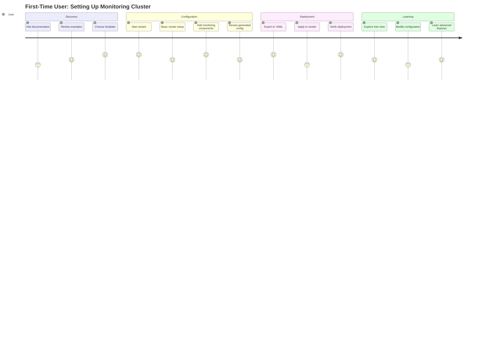
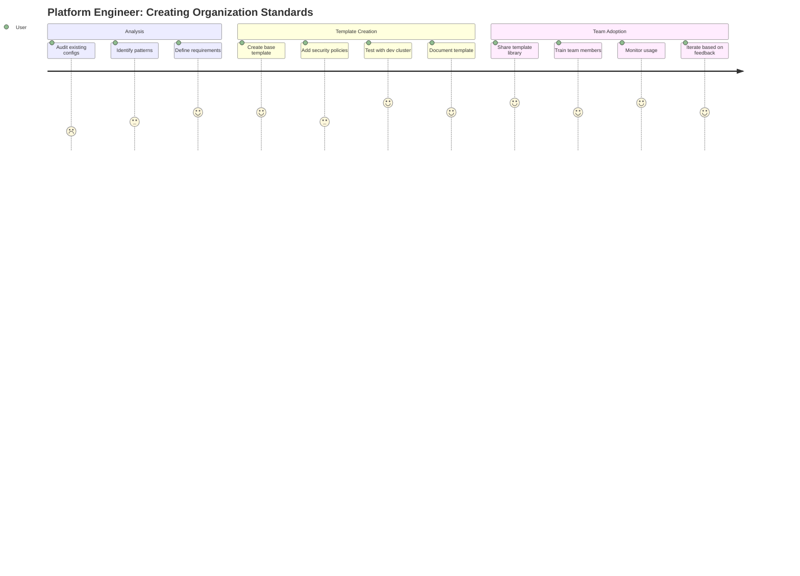
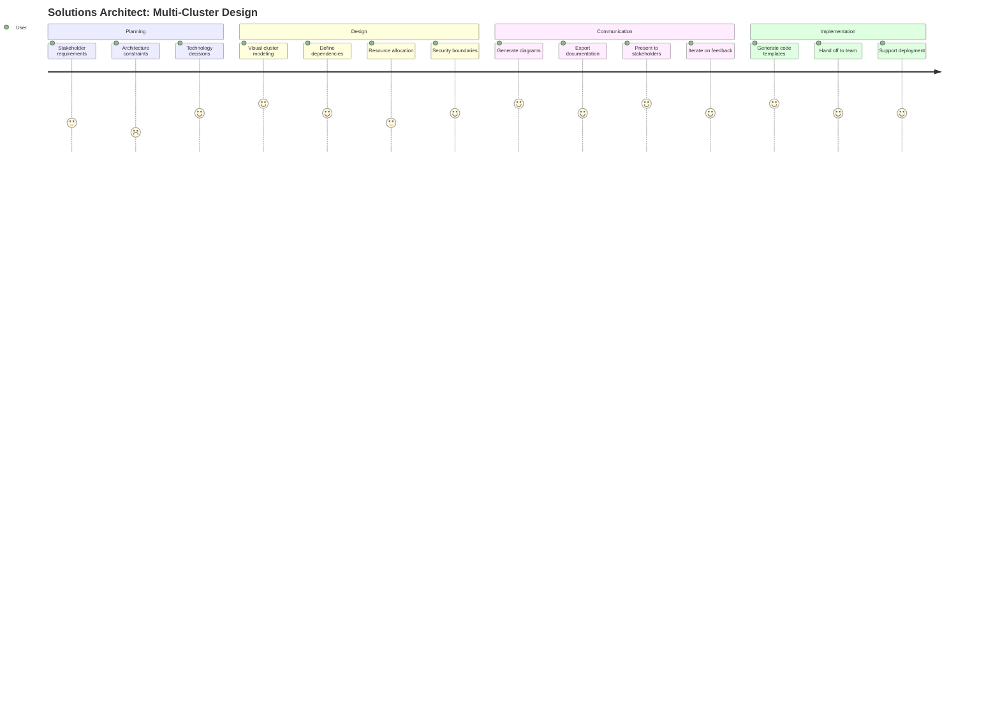

# Kure End User Experience Design Document

**Version:** 1.0  
**Date:** August 2025  
**Status:** Design Specification  

## Executive Summary

This document outlines a comprehensive user experience strategy for Kure, a Go library for programmatically building Kubernetes resources for GitOps workflows. The design focuses on creating multiple interaction modalities that serve different user types while maintaining Kure's core strengths of type safety, composability, and GitOps compatibility.

**Key Design Principles:**
- **Progressive Complexity**: Simple defaults with expert-level customization
- **Multi-Modal Interaction**: Visual, programmatic, and hybrid approaches
- **Type-Safe Configuration**: Leveraging Kure's existing validation and GVK system
- **GitOps Native**: Seamless integration with Flux and ArgoCD workflows

---

## Table of Contents

1. [User Research & Personas](#user-research--personas)
2. [Current State Analysis](#current-state-analysis)
3. [Vision & Design Principles](#vision--design-principles)
4. [User Journey Maps](#user-journey-maps)
5. [Multi-Modal Interface Design](#multi-modal-interface-design)
6. [Configuration Management System](#configuration-management-system)
7. [Implementation Roadmap](#implementation-roadmap)
8. [Success Metrics](#success-metrics)

---

## User Research & Personas

### Primary User Personas

#### 1. **Platform Engineer (Sarah)**
- **Role**: Senior Platform Engineer at mid-size tech company
- **Experience**: 5+ years Kubernetes, familiar with GitOps concepts
- **Goals**: Standardize cluster configurations, reduce operational overhead
- **Pain Points**: Complex YAML management, ensuring consistency across environments
- **Preferred Interaction**: Programmatic APIs with visual validation

#### 2. **DevOps Beginner (Mike)**
- **Role**: Junior DevOps Engineer, transitioning from traditional ops
- **Experience**: 1 year Kubernetes, new to GitOps
- **Goals**: Learn best practices, avoid configuration mistakes
- **Pain Points**: Overwhelmed by Kubernetes complexity, unclear dependencies
- **Preferred Interaction**: Guided workflows with explanations

#### 3. **Solutions Architect (Alex)**
- **Role**: Technical lead designing multi-cluster architectures
- **Experience**: 8+ years infrastructure, deep Kubernetes knowledge
- **Goals**: Design scalable, maintainable cluster architectures
- **Pain Points**: Visualizing complex dependencies, communicating designs to teams
- **Preferred Interaction**: Visual modeling with code generation

#### 4. **Development Team Lead (Jordan)**
- **Role**: Engineering manager overseeing application deployment
- **Experience**: 3 years Kubernetes, focused on application concerns
- **Goals**: Self-service application deployment, consistent configurations
- **Pain Points**: Waiting for platform team, inconsistent environments
- **Preferred Interaction**: Template-based configuration with customization

### User Needs Analysis

| User Type | Primary Need | Secondary Need | Success Criteria |
|-----------|--------------|----------------|------------------|
| Platform Engineer | Standardization & Automation | Visual Validation | Reduced config drift, faster onboarding |
| DevOps Beginner | Learning & Guidance | Error Prevention | Successful deployments, increased confidence |
| Solutions Architect | Design & Communication | Code Generation | Clear architecture docs, team alignment |
| Development Team Lead | Self-Service & Consistency | Template Management | Faster deployments, reduced dependencies |

---

## Current State Analysis

### **Existing Interaction Model**
Currently, users interact with Kure through direct Go code:

```go
// Manual, step-by-step creation
cluster := stack.NewCluster("production", rootNode)
node := stack.NewNode("infrastructure")
bundle := stack.NewBundle("monitoring")
app := stack.NewApplication("prometheus", appConfig)

// Manual hierarchy construction
cluster.AddNode(node)
node.AddBundle(bundle)
bundle.AddApplication(app)
```

### **Pain Points Identified**

1. **High Cognitive Load**: Users must understand the entire hierarchy upfront
2. **Verbose Construction**: Repetitive boilerplate for common patterns
3. **No Visual Feedback**: Difficult to validate complex configurations
4. **Limited Discoverability**: Hard to explore available options
5. **Expert-Only Access**: High barrier to entry for newcomers

### **Strengths to Preserve**

1. **Type Safety**: Compile-time validation prevents common errors
2. **Composability**: Clean separation of concerns across hierarchy
3. **GitOps Integration**: Native support for Flux and ArgoCD
4. **Extensibility**: Plugin system for custom generators
5. **Schema Evolution**: GVK system supports API versioning

---

## Vision & Design Principles

### **Vision Statement**
*"Make Kubernetes cluster configuration as intuitive as building with Lego blocks, while maintaining the precision and power of a programming language."*

### **Core Design Principles**

#### 1. **Progressive Disclosure**
- **Principle**: Reveal complexity gradually based on user needs
- **Implementation**: Start with simple templates, expose advanced options on demand
- **Example**: Wizard → Builder → Direct Code → YAML Export

#### 2. **Multi-Modal Interaction**
- **Principle**: Support different thinking and working styles
- **Implementation**: Visual, programmatic, and hybrid interfaces
- **Example**: Visual blocks for architects, code builders for engineers, forms for beginners

#### 3. **Fail-Fast Validation**
- **Principle**: Catch errors as early as possible in the configuration process
- **Implementation**: Real-time validation with contextual help
- **Example**: Immediate feedback on invalid configurations with suggested fixes

#### 4. **Convention over Configuration**
- **Principle**: Provide sensible defaults while allowing customization
- **Implementation**: Smart templates with override capabilities
- **Example**: Production-ready monitoring stack with one click, full customization available

#### 5. **Composable Architecture**
- **Principle**: Enable building complex systems from simple, reusable components
- **Implementation**: Mixins, templates, and inheritance patterns
- **Example**: Security mixin + monitoring mixin + custom application = complete cluster

---

## User Journey Maps

### **Journey 1: First-Time User Setup**



### **Journey 2: Platform Engineer Standardization**



### **Journey 3: Solutions Architect Design**



---

## Multi-Modal Interface Design

### **Interface Architecture Overview**

The Kure UX consists of four primary interaction modes that users can switch between seamlessly:

1. **Guided Wizard** - Step-by-step configuration for beginners
2. **Hierarchical Tree** - Structural navigation for intermediate users
3. **Visual Builder** - Block-based design for architects
4. **Code Editor** - Direct programmatic control for experts

### **1. Guided Wizard Interface**

#### **Purpose & Users**
- **Primary Users**: DevOps beginners, first-time users
- **Use Cases**: Initial cluster setup, learning Kure concepts
- **Key Features**: Progressive disclosure, contextual help, error prevention

#### **Design Specifications**

```typescript
interface WizardStep {
  id: string
  title: string
  description: string
  component: WizardStepComponent
  validation: ValidationRule[]
  dependencies: string[]
  canSkip: boolean
}

interface WizardFlow {
  steps: WizardStep[]
  currentStep: number
  userData: Record<string, any>
  branching: BranchingLogic
}
```

#### **Step Flow Design**

1. **Welcome & Template Selection**
   - Choose from curated templates (monitoring, web-app, database)
   - Preview template contents and generated resources
   - Option to start from scratch for advanced users

2. **Cluster Configuration**
   - Basic cluster metadata (name, description)
   - GitOps selection (Flux/ArgoCD) with explanations
   - Bootstrap configuration with sensible defaults

3. **Node Architecture**
   - Infrastructure vs application node separation
   - Hierarchical structure with visual preview
   - Package reference configuration (OCI/Git)

4. **Bundle Configuration**
   - Logical grouping of applications
   - Dependency management with visual graph
   - Source configuration and intervals

5. **Application Setup**
   - Generator selection (AppWorkload, FluxHelm, etc.)
   - Configuration forms based on JSON schema
   - Live preview of generated resources

6. **Review & Generate**
   - Complete configuration summary
   - Generated YAML preview with syntax highlighting
   - Validation results and recommendations
   - Export options (YAML, Go code, Terraform)

#### **UI Components**

```typescript
// Progress indicator
<WizardProgress 
  steps={wizardSteps}
  currentStep={currentStep}
  completedSteps={completedSteps}
/>

// Step content with validation
<WizardStep
  step={currentStepData}
  data={formData}
  onChange={handleStepChange}
  onValidate={validateStep}
  errors={validationErrors}
/>

// Navigation controls
<WizardNavigation
  canGoBack={currentStep > 0}
  canGoForward={isCurrentStepValid}
  onBack={handleBack}
  onForward={handleForward}
  onCancel={handleCancel}
/>
```

### **2. Hierarchical Tree Interface**

#### **Purpose & Users**
- **Primary Users**: Platform engineers, intermediate users
- **Use Cases**: Detailed configuration, structural modification
- **Key Features**: Expandable tree, contextual editing, bulk operations

#### **Design Specifications**

```typescript
interface TreeNode {
  id: string
  type: 'cluster' | 'node' | 'bundle' | 'application'
  name: string
  metadata: Record<string, any>
  children: TreeNode[]
  expanded: boolean
  selected: boolean
  errors: ValidationError[]
}

interface TreeViewState {
  rootNode: TreeNode
  selectedNodes: string[]
  expandedNodes: string[]
  searchFilter: string
  validationResults: ValidationResults
}
```

#### **Tree Structure Visualization**

```
🏭 Production Cluster
├── 📦 Infrastructure Node
│   ├── 📋 Monitoring Bundle
│   │   ├── 🔧 Prometheus App (AppWorkload)
│   │   ├── 📊 Grafana App (AppWorkload)
│   │   └── 🚨 AlertManager App (FluxHelm)
│   ├── 📋 Logging Bundle
│   │   ├── 📝 Fluentd App (FluxHelm)
│   │   └── 🔍 ElasticSearch App (FluxHelm)
│   └── 📋 Security Bundle
│       ├── 🛡️ Falco App (FluxHelm)
│       └── 🔐 OPA Gatekeeper App (FluxHelm)
└── 🎯 Applications Node
    ├── 📋 Frontend Bundle
    │   ├── 🌐 React App (AppWorkload)
    │   └── 🔄 Nginx Proxy (AppWorkload)
    └── 📋 Backend Bundle
        ├── ⚙️ API Server (AppWorkload)
        └── 🗄️ Database (FluxHelm)
```

#### **Interaction Patterns**

1. **Expand/Collapse**: Click chevron to show/hide children
2. **Selection**: Click item to select, multi-select with Ctrl/Cmd
3. **Context Menu**: Right-click for add/edit/delete/duplicate options
4. **Drag & Drop**: Reorganize hierarchy by dragging items
5. **Inline Editing**: Double-click names for quick renaming
6. **Search & Filter**: Real-time filtering with highlighting

#### **Property Panel Design**

```typescript
<PropertyPanel>
  <TabGroup>
    <Tab name="General">
      <FormField label="Name" value={selectedNode.name} />
      <FormField label="Description" value={selectedNode.description} />
      <FormField label="Labels" component={KeyValueEditor} />
    </Tab>
    <Tab name="Configuration">
      <DynamicForm schema={nodeSchema} data={nodeData} />
    </Tab>
    <Tab name="Advanced">
      <CodeEditor language="yaml" value={nodeYaml} />
    </Tab>
    <Tab name="Validation">
      <ValidationResults errors={validationErrors} />
    </Tab>
  </TabGroup>
</PropertyPanel>
```

### **3. Visual Builder Interface**

#### **Purpose & Users**
- **Primary Users**: Solutions architects, visual learners
- **Use Cases**: Architecture design, dependency visualization
- **Key Features**: Drag-drop composition, visual connections, layout algorithms

#### **Design Specifications**

```typescript
interface VisualComponent {
  id: string
  type: ComponentType
  position: { x: number, y: number }
  size: { width: number, height: number }
  properties: Record<string, any>
  connections: Connection[]
}

interface Connection {
  from: string
  to: string
  type: 'hierarchy' | 'dependency' | 'communication'
  style: ConnectionStyle
}

interface CanvasState {
  components: VisualComponent[]
  connections: Connection[]
  selectedComponents: string[]
  viewport: { x: number, y: number, zoom: number }
}
```

#### **Component Palette**

```typescript
const componentPalette = [
  {
    category: "Core",
    components: [
      { type: "cluster", icon: "🏭", label: "Cluster" },
      { type: "node", icon: "📦", label: "Node" },
      { type: "bundle", icon: "📋", label: "Bundle" },
      { type: "application", icon: "🎯", label: "Application" }
    ]
  },
  {
    category: "Templates",
    components: [
      { type: "monitoring-stack", icon: "📊", label: "Monitoring Stack" },
      { type: "web-app", icon: "🌐", label: "Web Application" },
      { type: "database", icon: "🗄️", label: "Database" },
      { type: "security-stack", icon: "🛡️", label: "Security Stack" }
    ]
  },
  {
    category: "Generators",
    components: [
      { type: "app-workload", icon: "⚙️", label: "App Workload" },
      { type: "flux-helm", icon: "📦", label: "Flux Helm" },
      { type: "kurel-package", icon: "📄", label: "Kurel Package" }
    ]
  }
]
```

#### **Visual Design System**

```css
/* Component visual styles */
.component {
  border-radius: 8px;
  box-shadow: 0 2px 8px rgba(0,0,0,0.1);
  transition: all 0.2s ease;
}

.component.cluster {
  background: linear-gradient(135deg, #4a90e2, #357abd);
  color: white;
  border: 3px solid #2c5aa0;
}

.component.node {
  background: linear-gradient(135deg, #52c41a, #389e0d);
  color: white;
  border: 2px solid #237804;
}

.component.bundle {
  background: linear-gradient(135deg, #fa8c16, #d46b08);
  color: white;
  border: 2px solid #ad4e00;
}

.component.application {
  background: linear-gradient(135deg, #722ed1, #531dab);
  color: white;
  border: 2px solid #391085;
}

/* Connection styles */
.connection {
  stroke-width: 2px;
  stroke-dasharray: none;
}

.connection.hierarchy {
  stroke: #4a90e2;
}

.connection.dependency {
  stroke: #fa8c16;
  stroke-dasharray: 5,5;
}

.connection.communication {
  stroke: #52c41a;
  stroke-dasharray: 2,3;
}
```

#### **Layout Algorithms**

```typescript
interface LayoutAlgorithm {
  name: string
  description: string
  apply: (components: VisualComponent[]) => VisualComponent[]
}

const layoutAlgorithms: LayoutAlgorithm[] = [
  {
    name: "Hierarchical",
    description: "Top-down tree layout following cluster hierarchy",
    apply: hierarchicalLayout
  },
  {
    name: "Force-Directed",
    description: "Physics-based layout emphasizing relationships",
    apply: forceDirectedLayout
  },
  {
    name: "Grid",
    description: "Organized grid layout for clean presentation",
    apply: gridLayout
  },
  {
    name: "Manual",
    description: "Free-form positioning with manual control",
    apply: (components) => components
  }
]
```

### **4. Code Editor Interface**

#### **Purpose & Users**
- **Primary Users**: Expert developers, power users
- **Use Cases**: Advanced customization, automation, debugging
- **Key Features**: Syntax highlighting, autocomplete, live validation

#### **Design Specifications**

```typescript
interface CodeEditorState {
  content: string
  language: 'go' | 'yaml' | 'json'
  cursorPosition: { line: number, column: number }
  validationErrors: ValidationError[]
  suggestions: CompletionItem[]
}

interface CodeGenerator {
  generateFromConfig(config: ClusterConfig): string
  parseFromCode(code: string): ClusterConfig
  validateCode(code: string): ValidationResult
}
```

#### **Editor Features**

1. **Syntax Highlighting**: Language-specific highlighting for Go, YAML, JSON
2. **Auto-completion**: Context-aware suggestions for Kure APIs
3. **Error Squiggles**: Real-time validation with inline error display
4. **Code Folding**: Collapse sections for better navigation
5. **Mini-map**: Overview of large files with scroll position
6. **Search & Replace**: Advanced find/replace with regex support

#### **Code Generation Templates**

```typescript
const codeTemplates = {
  go: {
    cluster: `
cluster := stack.NewClusterBuilder("{{name}}").
    WithGitOps("{{gitopsType}}").
    {{#nodes}}
    WithNode("{{name}}").
        {{#bundles}}
        WithBundle("{{name}}").
            {{#applications}}
            WithApplication("{{name}}", {{configVar}}).
            {{/applications}}
        End().
        {{/bundles}}
    End().
    {{/nodes}}
    Build()
`,
    monitoring: `
monitoringStack := stack.NewMonitoringStackBuilder().
    WithPrometheus({{prometheus}}).
    WithGrafana({{grafana}}).
    WithAlertManager({{alertmanager}}).
    Build()
`
  },
  yaml: {
    cluster: `
apiVersion: stack.gokure.dev/v1alpha1
kind: Cluster
metadata:
  name: {{name}}
spec:
  gitops:
    type: {{gitopsType}}
    bootstrap:
      enabled: {{bootstrapEnabled}}
  nodes:
    {{#nodes}}
    - name: {{name}}
      bundles:
        {{#bundles}}
        - name: {{name}}
          applications:
            {{#applications}}
            - {{&yaml}}
            {{/applications}}
        {{/bundles}}
    {{/nodes}}
`
  }
}
```

---

## Configuration Management System

### **Fluent Builder Architecture**

#### **Core Builder Pattern**

```go
// Base builder interface
type Builder interface {
    Build() (interface{}, error)
    Validate() error
    Clone() Builder
}

// Cluster builder with fluent API
type ClusterBuilder struct {
    name        string
    nodes       []NodeBuilder
    gitops      *GitOpsConfig
    validation  ValidationLevel
    metadata    map[string]interface{}
}

func NewClusterBuilder(name string) *ClusterBuilder {
    return &ClusterBuilder{
        name:       name,
        nodes:      []NodeBuilder{},
        validation: ValidationStrict,
        metadata:   make(map[string]interface{}),
    }
}

func (cb *ClusterBuilder) WithNode(name string) *NodeBuilder {
    nb := NewNodeBuilder(name, cb)
    cb.nodes = append(cb.nodes, *nb)
    return nb
}

func (cb *ClusterBuilder) WithGitOps(gitopsType string) *GitOpsBuilder {
    return NewGitOpsBuilder(gitopsType, cb)
}

func (cb *ClusterBuilder) Build() (*stack.Cluster, error) {
    if err := cb.Validate(); err != nil {
        return nil, err
    }
    
    cluster := stack.NewCluster(cb.name, nil)
    
    // Build nodes
    for _, nodeBuilder := range cb.nodes {
        node, err := nodeBuilder.Build()
        if err != nil {
            return nil, err
        }
        cluster.AddNode(node.(*stack.Node))
    }
    
    // Set GitOps configuration
    cluster.SetGitOps(cb.gitops)
    
    return cluster, nil
}
```

#### **Hierarchical Builder Navigation**

```go
type NodeBuilder struct {
    name       string
    bundles    []BundleBuilder
    parent     *ClusterBuilder
    packageRef *schema.GroupVersionKind
}

func (nb *NodeBuilder) WithBundle(name string) *BundleBuilder {
    bb := NewBundleBuilder(name, nb)
    nb.bundles = append(nb.bundles, *bb)
    return bb
}

func (nb *NodeBuilder) WithPackageRef(gvk *schema.GroupVersionKind) *NodeBuilder {
    nb.packageRef = gvk
    return nb
}

func (nb *NodeBuilder) End() *ClusterBuilder {
    return nb.parent
}

type BundleBuilder struct {
    name         string
    applications []ApplicationBuilder
    parent       *NodeBuilder
    interval     string
    sourceRef    *stack.SourceRef
}

func (bb *BundleBuilder) WithApplication(name string, config stack.ApplicationConfig) *BundleBuilder {
    ab := NewApplicationBuilder(name, config, bb)
    bb.applications = append(bb.applications, *ab)
    return bb
}

func (bb *BundleBuilder) End() *NodeBuilder {
    return bb.parent
}
```

### **Preset Configuration System**

#### **Template Registry**

```go
type PresetTemplate struct {
    Name        string
    Description string
    Category    string
    Tags        []string
    Builder     func() Builder
    Metadata    TemplateMetadata
}

type TemplateRegistry struct {
    templates map[string]PresetTemplate
    mutex     sync.RWMutex
}

func (tr *TemplateRegistry) Register(template PresetTemplate) error {
    tr.mutex.Lock()
    defer tr.mutex.Unlock()
    
    if _, exists := tr.templates[template.Name]; exists {
        return fmt.Errorf("template %s already exists", template.Name)
    }
    
    tr.templates[template.Name] = template
    return nil
}

func (tr *TemplateRegistry) Get(name string) (PresetTemplate, error) {
    tr.mutex.RLock()
    defer tr.mutex.RUnlock()
    
    template, exists := tr.templates[name]
    if !exists {
        return PresetTemplate{}, fmt.Errorf("template %s not found", name)
    }
    
    return template, nil
}

func (tr *TemplateRegistry) List() []PresetTemplate {
    tr.mutex.RLock()
    defer tr.mutex.RUnlock()
    
    templates := make([]PresetTemplate, 0, len(tr.templates))
    for _, template := range tr.templates {
        templates = append(templates, template)
    }
    
    return templates
}
```

#### **Built-in Presets**

```go
// Monitoring stack preset
func init() {
    registry.Register(PresetTemplate{
        Name:        "monitoring-stack",
        Description: "Complete monitoring solution with Prometheus, Grafana, and AlertManager",
        Category:    "infrastructure",
        Tags:        []string{"monitoring", "prometheus", "grafana", "alertmanager"},
        Builder: func() Builder {
            return NewMonitoringStackBuilder()
        },
    })
}

type MonitoringStackBuilder struct {
    name           string
    prometheus     bool
    grafana        bool
    alertmanager   bool
    nodeExporter   bool
    namespace      string
    storageSize    string
    retentionTime  string
}

func NewMonitoringStackBuilder() *MonitoringStackBuilder {
    return &MonitoringStackBuilder{
        name:          "monitoring",
        prometheus:    true,
        grafana:       true,
        alertmanager:  true,
        nodeExporter:  true,
        namespace:     "monitoring",
        storageSize:   "10Gi",
        retentionTime: "15d",
    }
}

func (msb *MonitoringStackBuilder) WithPrometheus(enabled bool) *MonitoringStackBuilder {
    msb.prometheus = enabled
    return msb
}

func (msb *MonitoringStackBuilder) WithGrafana(enabled bool) *MonitoringStackBuilder {
    msb.grafana = enabled
    return msb
}

func (msb *MonitoringStackBuilder) WithStorageSize(size string) *MonitoringStackBuilder {
    msb.storageSize = size
    return msb
}

func (msb *MonitoringStackBuilder) Build() (*stack.Node, error) {
    nodeBuilder := stack.NewNodeBuilder(msb.name).
        WithBundle("monitoring")
    
    if msb.prometheus {
        prometheusConfig := generators.NewPrometheusConfig().
            WithRetention(msb.retentionTime).
            WithStorageSize(msb.storageSize).
            Build()
        nodeBuilder.WithApplication("prometheus", prometheusConfig)
    }
    
    if msb.grafana {
        grafanaConfig := generators.NewGrafanaConfig().
            WithPrometheusDataSource(msb.prometheus).
            Build()
        nodeBuilder.WithApplication("grafana", grafanaConfig)
    }
    
    if msb.alertmanager {
        alertmanagerConfig := generators.NewAlertManagerConfig().
            Build()
        nodeBuilder.WithApplication("alertmanager", alertmanagerConfig)
    }
    
    return nodeBuilder.Build()
}
```

#### **Web Application Preset**

```go
func init() {
    registry.Register(PresetTemplate{
        Name:        "web-application",
        Description: "Scalable web application with ingress and autoscaling",
        Category:    "application",
        Tags:        []string{"web", "frontend", "ingress", "autoscaling"},
        Builder: func() Builder {
            return NewWebApplicationBuilder()
        },
    })
}

type WebApplicationBuilder struct {
    name          string
    image         string
    replicas      int32
    port          int32
    ingress       bool
    autoscaling   bool
    minReplicas   int32
    maxReplicas   int32
    cpuThreshold  int32
    resources     *corev1.ResourceRequirements
}

func NewWebApplicationBuilder() *WebApplicationBuilder {
    return &WebApplicationBuilder{
        replicas:     3,
        port:         80,
        ingress:      true,
        autoscaling:  false,
        minReplicas:  2,
        maxReplicas:  10,
        cpuThreshold: 70,
        resources: &corev1.ResourceRequirements{
            Requests: corev1.ResourceList{
                corev1.ResourceCPU:    resource.MustParse("100m"),
                corev1.ResourceMemory: resource.MustParse("128Mi"),
            },
            Limits: corev1.ResourceList{
                corev1.ResourceCPU:    resource.MustParse("500m"),
                corev1.ResourceMemory: resource.MustParse("512Mi"),
            },
        },
    }
}

func (wab *WebApplicationBuilder) WithImage(image string) *WebApplicationBuilder {
    wab.image = image
    return wab
}

func (wab *WebApplicationBuilder) WithReplicas(replicas int32) *WebApplicationBuilder {
    wab.replicas = replicas
    return wab
}

func (wab *WebApplicationBuilder) WithAutoscaling(enabled bool) *WebApplicationBuilder {
    wab.autoscaling = enabled
    return wab
}

func (wab *WebApplicationBuilder) WithIngress(enabled bool) *WebApplicationBuilder {
    wab.ingress = enabled
    return wab
}

func (wab *WebApplicationBuilder) Build() (*stack.Application, error) {
    appConfig := generators.NewAppWorkloadConfig().
        WithWorkload("Deployment").
        WithImage(wab.image).
        WithReplicas(wab.replicas).
        WithPort(wab.port).
        WithResources(wab.resources)
    
    if wab.ingress {
        appConfig.WithIngress(true)
    }
    
    if wab.autoscaling {
        appConfig.WithAutoscaling(wab.minReplicas, wab.maxReplicas, wab.cpuThreshold)
    }
    
    return stack.NewApplication(wab.name, "", appConfig.Build()), nil
}
```

### **Template Inheritance System**

```go
type TemplateInheritance struct {
    baseTemplate   string
    overrides      map[string]interface{}
    mixins         []string
}

type ApplicationTemplate struct {
    Name           string
    Description    string
    BaseTemplate   string
    DefaultConfig  map[string]interface{}
    RequiredFields []string
    OptionalFields []string
    Mixins         []Mixin
}

func NewApplicationFromTemplate(name string, template ApplicationTemplate) *ApplicationBuilder {
    builder := NewApplicationBuilder(name)
    
    // Apply base template configuration
    if template.BaseTemplate != "" {
        baseTemplate := GetTemplate(template.BaseTemplate)
        builder.ApplyTemplate(baseTemplate)
    }
    
    // Apply default configuration
    for key, value := range template.DefaultConfig {
        builder.SetProperty(key, value)
    }
    
    // Apply mixins
    for _, mixin := range template.Mixins {
        builder.ApplyMixin(mixin)
    }
    
    return builder
}

// Base application template with security and monitoring defaults
var BaseApplicationTemplate = ApplicationTemplate{
    Name:        "base",
    Description: "Base template with security and monitoring defaults",
    DefaultConfig: map[string]interface{}{
        "labels": map[string]string{
            "managed-by": "kure",
            "version":    "v1",
        },
        "securityContext": &corev1.PodSecurityContext{
            RunAsNonRoot: pointer.Bool(true),
            RunAsUser:    pointer.Int64(1000),
            FSGroup:      pointer.Int64(2000),
        },
        "resources": &corev1.ResourceRequirements{
            Requests: corev1.ResourceList{
                corev1.ResourceCPU:    resource.MustParse("100m"),
                corev1.ResourceMemory: resource.MustParse("128Mi"),
            },
            Limits: corev1.ResourceList{
                corev1.ResourceCPU:    resource.MustParse("500m"),
                corev1.ResourceMemory: resource.MustParse("512Mi"),
            },
        },
    },
    Mixins: []Mixin{
        SecurityMixin,
        MonitoringMixin,
    },
}
```

### **Mixin System**

```go
type Mixin struct {
    Name        string
    Description string
    Resources   []client.Object
    Labels      map[string]string
    Annotations map[string]string
    Apply       func(*ApplicationBuilder) error
}

var SecurityMixin = Mixin{
    Name:        "security",
    Description: "Security best practices including network policies and pod security",
    Apply: func(builder *ApplicationBuilder) error {
        // Add security context
        builder.WithSecurityContext(&corev1.PodSecurityContext{
            RunAsNonRoot: pointer.Bool(true),
            RunAsUser:    pointer.Int64(1000),
        })
        
        // Add network policy
        networkPolicy := kubernetes.CreateNetworkPolicy(builder.name, builder.namespace)
        builder.AddResource(networkPolicy)
        
        // Add pod security policy
        podSecurityPolicy := kubernetes.CreatePodSecurityPolicy(builder.name)
        builder.AddResource(podSecurityPolicy)
        
        return nil
    },
}

var MonitoringMixin = Mixin{
    Name:        "monitoring",
    Description: "Monitoring setup with service monitor and dashboards",
    Apply: func(builder *ApplicationBuilder) error {
        // Add monitoring labels
        builder.WithLabels(map[string]string{
            "monitoring": "enabled",
            "metrics":    "prometheus",
        })
        
        // Add service monitor
        serviceMonitor := prometheus.CreateServiceMonitor(builder.name, builder.namespace)
        builder.AddResource(serviceMonitor)
        
        // Add grafana dashboard
        dashboard := grafana.CreateDashboard(builder.name, builder.namespace)
        builder.AddResource(dashboard)
        
        return nil
    },
}
```

### **Environment Profiles**

```go
type EnvironmentProfile struct {
    Name          string
    Description   string
    DefaultValues map[string]interface{}
    Transformers  []ProfileTransformer
}

type ProfileTransformer func(*stack.Cluster) error

var DevelopmentProfile = EnvironmentProfile{
    Name:        "development",
    Description: "Development environment with minimal resources and debugging enabled",
    DefaultValues: map[string]interface{}{
        "replicas": map[string]int32{
            "frontend": 1,
            "backend":  1,
            "database": 1,
        },
        "resources": map[string]corev1.ResourceRequirements{
            "frontend": {
                Requests: corev1.ResourceList{
                    corev1.ResourceCPU:    resource.MustParse("50m"),
                    corev1.ResourceMemory: resource.MustParse("64Mi"),
                },
            },
        },
        "debug": true,
    },
    Transformers: []ProfileTransformer{
        EnableDebugLogging,
        DisableAutoscaling,
        AddDevelopmentLabels,
    },
}

var ProductionProfile = EnvironmentProfile{
    Name:        "production",
    Description: "Production environment with high availability and performance",
    DefaultValues: map[string]interface{}{
        "replicas": map[string]int32{
            "frontend": 3,
            "backend":  5,
            "database": 3,
        },
        "autoscaling": true,
        "monitoring":  true,
        "security":    true,
    },
    Transformers: []ProfileTransformer{
        EnableAutoscaling,
        EnableMonitoring,
        EnableSecurityPolicies,
        SetProductionLabels,
    },
}

func (cluster *stack.Cluster) ApplyProfile(profile EnvironmentProfile) error {
    // Apply default values
    for key, value := range profile.DefaultValues {
        if err := cluster.SetProperty(key, value); err != nil {
            return err
        }
    }
    
    // Apply transformers
    for _, transformer := range profile.Transformers {
        if err := transformer(cluster); err != nil {
            return err
        }
    }
    
    return nil
}
```

### **Configuration Validation System**

```go
type ValidationLevel string

const (
    ValidationNone   ValidationLevel = "none"
    ValidationBasic  ValidationLevel = "basic"
    ValidationStrict ValidationLevel = "strict"
    ValidationCustom ValidationLevel = "custom"
)

type ValidationRule struct {
    Name        string
    Description string
    Level       ValidationLevel
    Check       func(interface{}) ValidationResult
}

type ValidationResult struct {
    Valid    bool
    Errors   []ValidationError
    Warnings []ValidationWarning
    Suggestions []ValidationSuggestion
}

type ValidationError struct {
    Field   string
    Message string
    Code    string
    Hint    string
}

var ClusterValidationRules = []ValidationRule{
    {
        Name:        "cluster-name-format",
        Description: "Cluster name must follow Kubernetes naming conventions",
        Level:       ValidationBasic,
        Check: func(obj interface{}) ValidationResult {
            cluster := obj.(*stack.Cluster)
            if !isValidKubernetesName(cluster.Name) {
                return ValidationResult{
                    Valid: false,
                    Errors: []ValidationError{{
                        Field:   "name",
                        Message: "Invalid cluster name format",
                        Code:    "INVALID_NAME_FORMAT",
                        Hint:    "Name must be lowercase alphanumeric with hyphens",
                    }},
                }
            }
            return ValidationResult{Valid: true}
        },
    },
    {
        Name:        "gitops-consistency",
        Description: "GitOps configuration must be consistent across the cluster",
        Level:       ValidationStrict,
        Check: func(obj interface{}) ValidationResult {
            cluster := obj.(*stack.Cluster)
            if cluster.GitOps == nil {
                return ValidationResult{
                    Valid: false,
                    Errors: []ValidationError{{
                        Field:   "gitops",
                        Message: "GitOps configuration is required",
                        Code:    "MISSING_GITOPS_CONFIG",
                        Hint:    "Add GitOps configuration with type 'flux' or 'argocd'",
                    }},
                }
            }
            return ValidationResult{Valid: true}
        },
    },
}

func ValidateCluster(cluster *stack.Cluster, level ValidationLevel) ValidationResult {
    result := ValidationResult{Valid: true}
    
    for _, rule := range ClusterValidationRules {
        if rule.Level <= level {
            ruleResult := rule.Check(cluster)
            if !ruleResult.Valid {
                result.Valid = false
                result.Errors = append(result.Errors, ruleResult.Errors...)
            }
            result.Warnings = append(result.Warnings, ruleResult.Warnings...)
            result.Suggestions = append(result.Suggestions, ruleResult.Suggestions...)
        }
    }
    
    return result
}
```

---

## Implementation Roadmap

### **Phase 1: Foundation (Months 1-2)**

#### **Core Builder System**
- [ ] Implement fluent builder pattern for all stack components
- [ ] Create base template system with inheritance
- [ ] Add comprehensive validation framework
- [ ] Build configuration export/import functionality

**Deliverables:**
- Fluent API for cluster construction
- Basic validation system
- Template registry infrastructure
- Code generation utilities

**Success Criteria:**
- 80% reduction in boilerplate code for common configurations
- Zero compilation errors for generated configurations
- All existing Kure functionality accessible through builders

#### **Basic Presets**
- [ ] Monitoring stack preset (Prometheus + Grafana)
- [ ] Web application preset (Deployment + Service + Ingress)
- [ ] Database preset (StatefulSet + PVC + Service)
- [ ] Security baseline preset (RBAC + Network Policies)

**Deliverables:**
- 4 core preset templates
- Template documentation and examples
- Template testing framework

**Success Criteria:**
- New users can deploy monitoring stack in <5 minutes
- Presets generate production-ready configurations
- 90% test coverage for all presets

### **Phase 2: Core UI Components (Months 3-4)**

#### **Hierarchical Tree Interface**
- [ ] Tree component with expand/collapse functionality
- [ ] Context menus for add/edit/delete operations
- [ ] Property panel with dynamic form generation
- [ ] Real-time validation display

**Deliverables:**
- React tree component library
- Property editing system
- Validation UI components
- Tree state management

**Success Criteria:**
- Users can navigate 100+ item trees smoothly
- Property changes reflect immediately in tree
- Validation errors visible within 100ms

#### **Configuration Wizard**
- [ ] Multi-step wizard component framework
- [ ] Dynamic step generation based on templates
- [ ] Progress tracking and branching logic
- [ ] Integration with builder system

**Deliverables:**
- Wizard framework with step components
- Template-driven step generation
- Progress indicators and navigation
- Builder integration layer

**Success Criteria:**
- First-time users complete setup in <10 minutes
- <5% abandonment rate in wizard flow
- Generated configs match expert-created equivalents

### **Phase 3: Advanced Features (Months 5-6)**

#### **Visual Builder Interface**
- [ ] Canvas component with drag-drop functionality
- [ ] Component palette with preset blocks
- [ ] Connection visualization and editing
- [ ] Layout algorithms for automatic arrangement

**Deliverables:**
- Visual editor with drag-drop
- Component connection system
- Multiple layout algorithms
- Export to tree/code views

**Success Criteria:**
- Architects can design complex clusters visually
- Generated diagrams suitable for documentation
- Visual and code representations stay synchronized

#### **Code Editor Integration**
- [ ] Syntax-highlighted code editor
- [ ] Real-time compilation and validation
- [ ] Auto-completion for Kure APIs
- [ ] Bidirectional sync with visual editors

**Deliverables:**
- Code editor with Kure syntax support
- Auto-completion engine
- Real-time error highlighting
- Multi-format export (Go, YAML, JSON)

**Success Criteria:**
- Power users prefer code editor for complex edits
- Auto-completion reduces API lookup time by 70%
- Code validation catches 95% of errors before compilation

### **Phase 4: Collaboration & Polish (Months 7-8)**

#### **Template Sharing & Collaboration**
- [ ] Template marketplace with discovery
- [ ] Version control integration for templates
- [ ] Team sharing and permissions
- [ ] Template composition and inheritance

**Deliverables:**
- Template marketplace UI
- Git integration for template versioning
- Team collaboration features
- Template dependency management

**Success Criteria:**
- 50+ community-contributed templates
- Teams share templates across projects
- Template reuse reduces config time by 60%

#### **Documentation & Onboarding**
- [ ] Interactive tutorials integrated in UI
- [ ] Context-sensitive help system
- [ ] Video tutorials and documentation
- [ ] Migration guides for existing users

**Deliverables:**
- Interactive tutorial system
- Comprehensive documentation site
- Video tutorial library
- Migration tooling

**Success Criteria:**
- 90% of new users complete onboarding successfully
- Support ticket volume reduced by 40%
- Documentation satisfaction score >4.5/5

---

## Success Metrics

### **Primary KPIs**

#### **User Adoption Metrics**
- **Monthly Active Users**: Target 500+ regular users within 6 months
- **Template Usage**: 70% of clusters created using presets/templates
- **Completion Rate**: 85% wizard completion rate for new users
- **Retention**: 60% user retention after 30 days

#### **Developer Experience Metrics**
- **Time to First Success**: <10 minutes for new user to deploy working cluster
- **Configuration Time**: 50% reduction in time to configure complex clusters
- **Error Rate**: <5% of generated configurations fail validation
- **API Discovery**: 80% of users discover new features through UI

#### **Quality Metrics**
- **Bug Reports**: <2 critical bugs per release
- **Performance**: UI responds to user actions in <100ms
- **Accessibility**: WCAG 2.1 AA compliance
- **Mobile**: Basic functionality on tablet devices

### **Secondary KPIs**

#### **Community Engagement**
- **Template Contributions**: 10+ community templates per month
- **Documentation**: 90% of features have up-to-date documentation
- **Support**: Average issue resolution time <24 hours
- **Feedback**: >4.0/5 average satisfaction rating

#### **Technical Excellence**
- **Test Coverage**: >90% code coverage for UI components
- **Performance**: <1MB initial bundle size
- **Compatibility**: Support for latest 2 versions of major browsers
- **Reliability**: 99.9% uptime for hosted components

### **User Feedback Collection**

#### **Quantitative Methods**
1. **Analytics Tracking**: User journey analysis, feature usage patterns
2. **A/B Testing**: Interface variations, onboarding flows
3. **Performance Monitoring**: Load times, error rates, user actions
4. **Survey Data**: NPS scores, satisfaction ratings, feature requests

#### **Qualitative Methods**
1. **User Interviews**: Monthly sessions with power users and beginners
2. **Usability Testing**: Task-based testing with screen recording
3. **Support Ticket Analysis**: Common issues and confusion points
4. **Community Feedback**: GitHub issues, forum discussions

### **Continuous Improvement Process**

#### **Weekly Reviews**
- Performance metrics analysis
- Bug triage and prioritization
- User feedback review
- Feature usage assessment

#### **Monthly Assessments**
- User journey optimization
- Feature success evaluation
- Documentation gap analysis
- Community engagement review

#### **Quarterly Planning**
- Roadmap adjustment based on metrics
- Major feature planning
- User research planning
- Technology stack evaluation

---

## Conclusion

This comprehensive UX design document outlines a path to transform Kure from a powerful but complex library into an accessible, multi-modal platform that serves users across the entire expertise spectrum. By implementing progressive disclosure, multi-modal interfaces, and intelligent configuration management, we can maintain Kure's technical excellence while dramatically improving its usability.

The success of this initiative will be measured not just in adoption metrics, but in the quality of Kubernetes configurations users create and the confidence they gain in managing complex infrastructure. Through careful implementation of the roadmap and continuous feedback collection, Kure can become the definitive tool for GitOps-native cluster configuration.

**Next Steps:**
1. Validate design concepts with target users
2. Create detailed technical specifications for Phase 1
3. Begin implementation of core builder system
4. Establish user feedback collection processes
5. Start building community around template sharing

---

*This document is a living specification that will evolve based on user feedback and implementation learnings.*